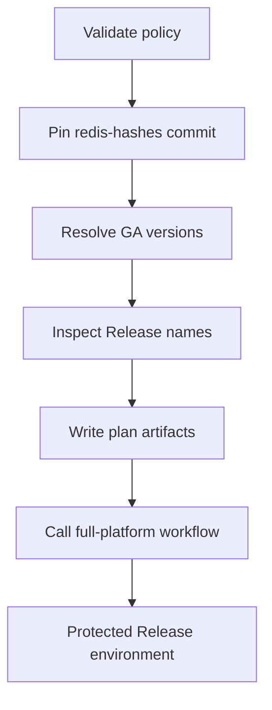

# Multi-platform release design

[简体中文](PLATFORM-DESIGN.zh-CN.md)

This document separates the atomic stable Release contract, manually generated
experimental Actions artifacts, and design-only backends. **Implemented** means
that code, CI, semantic validation, native lifecycle gates, and stable
publication policy exist. Manual dispatch of the read-only platform builder
still emits experimental artifacts; only the protected stable caller can bind
those jobs into a `Redis-X.Y.Z` Release. **Design only** means that no build
artifact is claimed.

## Redis release lines

Tracked `X.Y` series are declared in
[`config/release-lines.json`](../config/release-lines.json). The controller
selects the highest stable `X.Y.Z` with an official SHA-256 record for each
enrolled series; it does not rebuild every historical source tarball. Current
configuration enrolls `6.2`, `7.2`, `7.4`, `8.0`, `8.2`, `8.4`, `8.6`,
`8.8`, and `8.10`. The configuration, not this prose list, is authoritative.

Enrollment follows the official
[Redis version-management policy](https://redis.io/docs/latest/operate/oss_and_stack/install/version-mgmt/).
When an enrolled line passes its configured EOL date, automatic planning
stops for that line. A stable series above `new_series_floor` is reported as a
candidate and requires a reviewed configuration change before it can enter a
build plan. Prereleases are excluded.

License review is a release-line gate. According to the official
[Redis license summary](https://redis.io/legal/licenses/), Redis 7.2.x and
earlier use BSD-3-Clause, 7.4.x through 7.8.x use RSALv2/SSPLv1, and Redis 8
and later offer RSALv2, SSPLv1, or AGPLv3. A package must retain the exact
license and notice material from its verified source version. Redis names and
marks remain subject to the official
[trademark policy](https://redis.io/legal/trademark-policy/).

## Platform matrix

| Variant | Architectures | Build baseline | Service backend | Status |
| --- | --- | --- | --- | --- |
| `linux-glibc2.28` | x64, ARM64 | Digest-pinned Rocky Linux 8 user space | systemd | **Implemented** |
| `linux-glibc2.17-legacy` | x64, ARM64 | Digest-pinned manylinux2014 (glibc 2.17) | systemd or no-service | **Implemented** |
| `linux-musl1.2` | x64, ARM64 | Digest-pinned musllinux 1.2 | OpenRC | **Implemented** |
| `macos15` | x64, ARM64 | Native macOS 15 runners, deployment target 15.0 | launchd | **Implemented** |
| `windows-msys2` | x64 | Windows Server 2022 runner and MSYS2 | Windows SCM | **Implemented**; primary Windows backend |

All nine rows are controller-enabled and bind their stable package identity to
`build-all-platforms.yml`. The full-platform workflow calls the read-only platform
workflow for the additional native jobs, but that implementation detail does
not change the stable workflow identity recorded in package metadata. All Linux archives use
`.tar.gz` rather than RPM, DEB, Snap, or APK and use the fixed prefix
`/usr/local/redis`. Windows uses `.zip` and the fixed prefix
`C:\Program Files\Redis-Unofficial`.

Installations created before the current runtime-identity cleanup are
intentionally rejected by the new update scripts. Back up
configuration and data, uninstall with the lifecycle scripts from the
installed package, and then perform a fresh install.

### ABI principles

- A glibc 2.28 binary cannot be assumed to run on glibc 2.17. The legacy
  variant must be built separately, and every ELF must be scanned for its
  highest required `GLIBC_*` symbol.
- A legacy libc baseline does not make an end-of-life operating system secure
  or supported.
- musl and glibc are different ABIs and never share an archive. The musl
  backend requires `scanelf`/dependency inspection and real OpenRC lifecycle
  tests.
- `-march=native` is forbidden. x64 and ARM64 use conservative ISA baselines
  unless a separately named optimized variant is introduced.
- macOS architectures are built and tested natively. The deployment target is
  an ABI floor, not a security-support promise.
- An x64 Windows package running under emulation is not ARM64. Native Windows
  ARM64 requires a compatible native toolchain and real service, persistence,
  and load tests on ARM64 Windows.

## Implemented glibc package contract

The current profile is `core`: Redis server and command-line binaries are
included, while Redis 8 bundled modules are excluded. A module-enabled profile
requires a distinct variant plus separate compiler, dependency, license,
persistence, and upgrade gates. TLS is disabled.

Every archive has a `redis/` root and contains:

- `PACKAGE-INFO` format 2 and `BUILD-INFO`;
- the Redis binaries and sample configuration;
- install, update, and uninstall scripts;
- the systemd unit and an optional hardening example;
- upstream `LICENSE.txt`;
- `UPSTREAM-CONTRIBUTOR-LICENSE.txt` for Redis 7.4+ and for any older source
  that actually contains `REDISCONTRIBUTIONS.txt`;
- deterministic `UPSTREAM-DEPENDENCY-NOTICES.txt` generated from recognized
  notice files under the verified source tree's `deps/` directory;
- project `THIRD_PARTY_NOTICES.md` and package `README.txt`.

No contributor-license placeholder is generated for an older source that
lacks the upstream file. The dependency-notice collection uses deterministic
path ordering and framed path/length records with bounded file count and
size; it preserves source text without claiming complete legal classification.
Metadata stores hashes for these notice artifacts, or the explicit absence
state where the contributor file is legitimately unavailable.

Key `PACKAGE-INFO` fields include:

```text
PACKAGE_FORMAT=2
PACKAGE_ID=redis-unofficial-builds
REDIS_VERSION=7.4.11
REDIS_SERIES=7.4
BUILD_PROFILE=core
PACKAGE_VARIANT=linux-glibc2.28
PACKAGE_ARCH=x64
OS=linux
LIBC=glibc
MIN_GLIBC=2.28
SERVICE_BACKEND=systemd
INSTALL_PREFIX=/usr/local/redis
UPSTREAM_SOURCE_SHA256=...
UPSTREAM_CONTRIBUTOR_LICENSE_SHA256=...
UPSTREAM_DEPENDENCY_NOTICES_SHA256=...
PATCHSET_SHA256=...
```

The CI builder runs as an unprivileged account in a controlled container,
downloads the official source over HTTPS, verifies its planned SHA-256 before
extraction, runs upstream build/test code, and packages only from a private
staging tree. It refuses UID 0 and refuses a host with a live
`/usr/local/redis`. The packaging repository snapshot is root-owned and
read-only to the builder. DNF packages are resolved from Rocky repositories,
so compiler/runtime details are recorded but bit-for-bit reproducibility is
not claimed.

## Reusable platform-build contract

The platform workflow first pins and strictly parses an official
`redis/redis-hashes` snapshot, downloads the matching source archive, and
passes the verified archive between jobs. It has repository `contents: read`
permission and no tag, Release, downstream workflow-dispatch API, or
publication step. Manual dispatch sets `PACKAGE_STATUS=experimental` and
records `build-experimental.yml`; those seven-day Actions artifacts cannot
enter a `Redis-X.Y.Z` Release.

When called by `build-all-platforms.yml`, the same jobs receive the caller's exact
version, source SHA-256, and immutable hashes commit, set
`PACKAGE_STATUS=release`, and record `build-all-platforms.yml`. The glibc 2.17 package
uses format 2; musl, macOS, and Windows use format 3. Both formats bind source
digest, redis-hashes commit, packaging revision, exact platform identity,
reviewed lifecycle assets, and a patch-set digest that includes the stable
workflow. A manual package and a release package therefore cannot be confused
by status or workflow identity.

Archive validation does not trust filenames alone. It reads without
extraction and rejects unexpected members, traversal, links, special files,
unsafe modes, oversized content, compression bombs, architecture/runtime
mismatches, and active `loadmodule` records. ELF architecture, interpreter,
dynamic dependencies, Redis version, and highest required `GLIBC_*` symbol;
Mach-O architecture and minimum OS; Windows PE architecture, Redis version,
MSYS2 DLL inventory/notices, lifecycle scripts, and service wrapper are all
checked from archive contents.

Lifecycle acceptance covers fresh and repeated install, readiness, update,
saved-data reload, ordinary-uninstall recovery, purge, and platform-specific
failure boundaries. OpenRC, launchd, and Windows execute fault-injected update
rollback. Windows additionally tests a non-ASCII/space staging path, port
conflict and install rollback, BGSAVE, bounded `redis-benchmark`, Sentinel
binary identity, unexpected child exit with SCM recovery, and `redis.conf`-
authenticated readiness and graceful shutdown. TLS is not built and is not
claimed. The glibc 2.17 gate runs on the pinned legacy user space in
`--no-service` mode; the identical systemd lifecycle assets are independently
tested by both glibc 2.28 architecture jobs.

## Current GitHub Release contract

One Redis `X.Y.Z` identity uses `Redis-X.Y.Z` by default or a configured
`Redis-X.Y.Z-rN` packaging revision when an immutable historical tag cannot be
reused. The full-platform
publisher accepts exactly these 21 asset names:

```text
Redis-{version}-linux-glibc2.28-x64.tar.gz
Redis-{version}-linux-glibc2.28-x64.tar.gz.sha256
Redis-{version}-linux-glibc2.28-arm64.tar.gz
Redis-{version}-linux-glibc2.28-arm64.tar.gz.sha256
Redis-{version}-linux-glibc2.17-legacy-x64.tar.gz
Redis-{version}-linux-glibc2.17-legacy-x64.tar.gz.sha256
Redis-{version}-linux-glibc2.17-legacy-arm64.tar.gz
Redis-{version}-linux-glibc2.17-legacy-arm64.tar.gz.sha256
Redis-{version}-linux-musl1.2-x64.tar.gz
Redis-{version}-linux-musl1.2-x64.tar.gz.sha256
Redis-{version}-linux-musl1.2-arm64.tar.gz
Redis-{version}-linux-musl1.2-arm64.tar.gz.sha256
Redis-{version}-macos15-x64.tar.gz
Redis-{version}-macos15-x64.tar.gz.sha256
Redis-{version}-macos15-arm64.tar.gz
Redis-{version}-macos15-arm64.tar.gz.sha256
Redis-{version}-windows-msys2-x64.zip
Redis-{version}-windows-msys2-x64.zip.sha256
SHA256SUMS
manifest.json
redis-unofficial-builds-{version}.spdx.json
```

No missing or additional asset is accepted. `SHA256SUMS` hashes the other 20
files. `manifest.json` binds source URL/SHA-256, the immutable
`redis-hashes` commit, packaging revision, per-platform patch-set checksum,
workflow, profile, OS, architecture, runtime/ABI baseline, service backend,
sizes, and archive digests.

The SPDX 2.3 document describes the verified Redis source and all nine archive
packages with `filesAnalyzed=false`. Its declared scope is
`release-package-level`; it must not be presented as a complete file-level or
transitive dependency SBOM.

The workflow creates SLSA provenance attestations for all 21 assets and SPDX
attestations for all nine archives. Before publication it verifies exact
workflow identity, signer/source revision, protected default-branch ref,
predicate type, and denial of self-hosted runners.

### New-Release-only publication

The publisher operates only when neither the tag nor Release exists:

1. all nine platform builds and lifecycle tests pass;
2. the 21 files are created and semantically validated;
3. attestations are generated and verified;
4. a single draft Release is created with all 21 files;
5. its REST `target_commitish`, draft state, and exact inventory are read back;
6. every remote numeric asset ID, byte size, and GitHub SHA-256 digest is
   bound to the verified local file, then all assets are downloaded,
   semantically validated, and attestation-verified again;
7. immediately before publication, the same draft identity, draft/prerelease
   state, tag OID, asset IDs, sizes, digests, and exact inventory are read back
   again; and
8. the draft is published by numeric Release ID with `latest=false`, after
   which the published identities are read back and every asset is downloaded,
   semantically validated, and attestation-verified again.

The automation never adds to, overwrites, deletes from, or completes an
existing Release. A draft, prerelease, incomplete, legacy-contract, or
extra-asset Release blocks automation and requires maintainer review. An
existing exact Release is downloaded, semantically validated, checked against
its tag revision, and attestation-verified before the build is skipped.
A manual nonpublishing `force_rebuild` may produce Actions artifacts after
that validation, but cannot mutate or republish the Release.

A failed draft publication can leave a draft and tag. Later runs refuse to
mutate them rather than attempting automatic rollback or repair. GitHub does
not provide an atomic compare-and-publish operation for all draft fields, so
this project policy complements rather than replaces repository-level
Immutable Releases and restricted Release write access.

### External repository protections

YAML references, but cannot configure, the required protections. Repository
administrators must:

- protect the default branch with a branch protection rule or ruleset; and
- configure the `release` Environment with required reviewers and deployment
  branch restrictions that allow only the protected default branch;
- enable repository-level Immutable Releases before production publication;
  and
- restrict Release write access to the reviewed workflow and trusted
  maintainers.

The release job checks `github.ref_protected` and the default-branch ref before
receiving scoped `contents: write`, `id-token: write`, `attestations: write`,
and `artifact-metadata: write` permissions. Normal planning and building retain
read-only repository access.

## Linux lifecycle contract

The implemented lifecycle scripts require Bash, GNU userland utilities,
`flock` and `setpriv` from util-linux, account-management tools, and systemd
when service mode is selected. Distribution package names are documented in
the main [README](../README.md).

### Filesystem and account trust

- Lifecycle scripts run as root but require the extracted package tree to be
  root-owned, not group/world-writable, without extended ACLs, unexpected
  symlinks, multiple hard links, or special files. Regular files may not have
  setuid, setgid, or sticky mode bits. Directories are constrained by ownership
  and writability rather than a blanket special-mode-bit prohibition.
- A new `redis` account is non-login and has only the `redis` group. An
  existing account is reused only with nonzero UID/GID, that primary and sole
  group, a `nologin`/`false` shell, and a canonical absolute home path.
  Current-format state pins UID, primary GID, home, shell, and the
  supplementary-group set. Migration from older
  state clears user/group creation ownership because the older format cannot
  prove the complete identity.
- With current-format state, project-created accounts are removed on purge
  only when UID, primary GID, home, shell, and absence of supplementary groups
  exactly match the recorded identity; the group must retain its recorded GID
  and have no unexpected explicit members. Older state without the complete
  identity record conservatively preserves both account and group. Existing
  accounts are retained.
- Recursive operations reject a mount at the target or any descendant.
- Install/update copies do not preserve SELinux contexts or extended
  attributes from staging. The target host must apply its own policy and
  relabel when necessary.

### Configuration and service trust

A fresh configuration sets `port 0`, uses
`/usr/local/redis/data/redis.sock` with mode `0770`, and stores data under
`/usr/local/redis/data`. Adoption and update preserve existing configuration
and data.

Configuration validation recursively follows at most 64 unique `include`
files and checks files referenced by `loadmodule` and `aclfile`. References
may be absolute or relative to `/usr/local/redis` but cannot contain
whitespace, globs, or backslashes. Path components cannot be symlinks; parent
chains and single-link regular files must be root controlled and free of
extended ACLs. Module arguments are permitted after the validated module path.

This contract makes a managed `aclfile` root-owned and not group/world-writable;
the Redis service account therefore cannot use `ACL SAVE` to update it.
Administrators must deploy ACL changes offline as root and restart Redis, or
use a site-controlled equivalent that restores trusted ownership and modes
before any root lifecycle operation. Relaxing the file permissions for
runtime `ACL SAVE` and then invoking package maintenance is outside the
supported trust contract.

The base systemd unit runs Redis in the foreground. A foreign
`redis.service` is rejected unless `--force-service` is supplied and the unit
is `inactive` or `failed`. Active or reloading foreign units are always
refused. A disabled foreign unit is enabled after replacement and rollback
restores its disabled state; an enabled foreign unit remains enabled.
Effective managed units and drop-ins are checked for the exact
identity, command, working directory, environment/credential isolation,
execution-hook absence, and `NoNewPrivileges` contract.

`--no-service` is a complete managed installation mode: it still manages the
account, configuration/data directories, package metadata, and lifecycle
state, but neither requires nor registers systemd. Because no service manager
is available to stop Redis, the administrator must stop every process whose
executable is exactly `/usr/local/redis/bin/redis-server` before update or
uninstall; maintenance fails closed while any such process remains.

### Update and removal

- Install, update, and uninstall share an exclusive lock.
- Update validates the new binary before stopping Redis, preserves
  configuration/data, and backs up programs, configuration, units, notices,
  metadata, and state under `/usr/local/redis-backups/`.
- Readiness requires a Redis protocol response. Failure or handled termination
  signals roll back program and service state.
- The automatic backup excludes Redis data. Production maintenance requires
  an independent application-consistent snapshot.
- Downgrades are refused unless `--allow-downgrade` is explicitly supplied.
  This also applies when an older package is reinstalled over lifecycle state
  retained by an ordinary uninstall; an independent data snapshot is required
  before explicitly permitting either operation.
- Uninstall preserves configuration, data, state, account, and backups by
  default. `--purge` removes the fixed prefix subject to account and mount
  safety checks.

## Additional implemented backends

### glibc 2.17 legacy

This is a separately named legacy-ABI compatibility package, not a replacement
for the glibc 2.28 baseline. Its builder uses digest-pinned
manylinux2014 images and rejects any ELF requiring a symbol newer than
`GLIBC_2.17`. The release gate executes fresh install, update, saved-data
reload, ordinary-uninstall recovery, and purge for both architectures in the
matching manylinux2014/CentOS 7 user space using `--no-service`. It reuses the
same reviewed systemd lifecycle files whose installation, failure rollback,
update rollback, persistence, and purge are exercised by both glibc 2.28
architecture jobs. This is an ABI-compatibility contract, not a claim that an
end-of-life distribution receives operating-system security maintenance.

### musl and OpenRC

The musl archive is built in digest-pinned musllinux 1.2 images,
must carry the musl interpreter, must contain no `GLIBC_*` references, and
includes a distinct OpenRC lifecycle contract. The release gate tests both
architectures in a disposable Alpine container with OpenRC: fresh and repeated
install, service restart, saved-data reload, ordinary uninstall, update-based
recovery, injected update rollback, and purge. The container exercises
`rc-service`/`rc-update` with an OpenRC softlevel but does not boot OpenRC as
PID 1; this limit is explicit and no systemd compatibility is inferred. The
OpenRC scripts have a distinct service/state contract and cannot depend on
glibc or systemd. Lifecycle entry points validate their own files before
loading shared code and require the entire extracted package tree to be
root-owned and not group/world-writable. The OpenRC command line forces
`--daemonize no`; graceful stop allows 600 seconds before the final kill
fallback.

### macOS

Each architecture is built and lifecycle-tested on a native macOS 15 runner
with deployment target 15.0. Archive validation checks Mach-O architecture, deployment target,
and approved system-library paths. The launchd backend manages a recorded
non-login account, preserves configuration/data, verifies PING readiness, and
includes update/rollback/uninstall scripts. The release gate runs fresh and
repeated install, launchd restart, saved-data reload, ordinary-uninstall
recovery, injected update rollback, and purge for both architectures. A
universal archive is not published; x64 and ARM64 remain independently named
and validated. Lifecycle entry points apply the same pre-load and full-tree
staging trust checks as the musl backend. The launchd job forces
`--daemonize no` and declares both soft and hard `NumberOfFiles` limits of
65,536.

### Windows

The Windows design explicitly references Apache-2.0-licensed
[`redis-windows/redis-windows`](https://github.com/redis-windows/redis-windows)
at commit
[`17fd667560f7903820dcabeebb9d20ade1159fe9`](https://github.com/redis-windows/redis-windows/commit/17fd667560f7903820dcabeebb9d20ade1159fe9).
The reference is fixed so design conclusions and issue mappings are
reproducible. This repository's Windows wrapper is an independent
implementation and incorporates no source file from that project. Attribution
and any future incorporation requirements are recorded
in [`THIRD_PARTY_NOTICES.md`](../THIRD_PARTY_NOTICES.md).

MSYS2 x64 is the implemented Windows backend. The service wrapper keeps Redis
in foreground mode, validates configuration paths, propagates startup/child-exit
failure to the Service Control Manager, performs real readiness checks, uses
bounded graceful shutdown and process-tree fallback, keeps the password out of
CLI arguments, redacts its literal value in captured Redis output, records
diagnostic output, and maintains protected installation
state under the fixed prefix. Backups use
`C:\ProgramData\Redis-Unofficial\Backups`; the data root, backup root and each
unpredictably named backup are owned and writable only by SYSTEM or
Administrators. Rollback revalidates that trust boundary before restoring.

Windows lifecycle entry points validate ownership, ACLs and reparse points
before loading `Common-Redis.ps1`. Run them only from a package tree extracted
by an elevated administrator beneath a trusted system directory such as
`Program Files`; user-owned Downloads or temporary directories are rejected.

New services use LocalService, not LocalSystem. Updating a legacy LocalSystem
installation migrates it to LocalService while retaining its service registration;
rollback restores the previous account. Unexpected custom accounts are rejected
before replacement, not silently overwritten. Service creation, update and rollback
apply the bounded SCM recovery policy. Native acceptance must check both the service
account and Redis child SID; source/mock tests alone do not certify this migration.

The wrapper reads `conf\redis.conf` directly for `bind`, `port` and `requirepass`;
no JSON settings or separate password file is needed. Edit that file, save as
UTF-8 without BOM, and run `Restart-Service -Name RedisUnofficial` in elevated
PowerShell. Numeric local IPv4/IPv6 addresses, including non-loopback addresses,
and custom ports are supported. Wildcard binds use loopback for service control.
Redis quoting/escapes and last-directive-wins ordering are respected. Explicit
`include` files must stay inside the installation directory without symbolic
links/reparse points or globs; relative paths follow Redis's working directory
and preceding `dir` directives, not the including file's parent. Parsing is
bounded to 16 nested files, 64 file reads, 4 MiB total and 65,536 characters per
line. Other Redis settings remain Redis's responsibility.

The wrapper supplies `requirepass` through `REDISCLI_AUTH` for readiness and
shutdown. It captures settings once at startup: editing the file while running
does not redirect shutdown; the next start reads the new settings. Runtime
`CONFIG SET`/ACL changes are not tracked. The service requires `daemonize no`,
`supervised no`, a nonzero plain TCP port and unrenamed `PING`/`AUTH`/`SHUTDOWN`.
Inline `user` ACLs, `aclfile`, TLS and Sentinel mode fail with an explicit error
before launch. ACL hashes cannot be converted back into a client password;
existing ACL deployments need a separate access-control migration, not deletion
of their ACL rules. This replaces the old optional named-user/password-file
contract. Graceful stop waits up to 60 seconds after the shutdown command before
terminating the managed process tree.

Use `Update-Redis.ps1` from the new package even for the same Redis version:
managed programs and scripts are refreshed, not skipped by version or wrapper hash.
The updater preserves `conf` and
`data`, backs up legacy `RedisService.json` for rollback, and removes the active
copy after the new wrapper passes self-test. Previously published packages
still contain their original wrapper until replaced.

The Windows Server 2022 gate covers an extraction path containing spaces and
non-ASCII text, port-conflict install rollback, fresh and repeated install,
same-version update, PING readiness, BGSAVE, bounded load, SCM restart and
unexpected-child recovery with persisted key reload, ordinary-uninstall
retention, update-based service recovery, authenticated graceful stop/start,
fault-injected update rollback, and purge. The Sentinel executable identity is
validated, but no managed Sentinel service is published. TLS and AOF-specific
acceptance are not enabled or claimed. Windows builds currently use `-O0` for
MSYS2 compatibility, including release packages. The complete upstream Redis
test suite is disabled on Windows; protocol smoke tests and native lifecycle
checks run instead. Optimized Windows builds remain unvalidated, and no
Linux-equivalent performance is promised. See
[Windows issue coverage](WINDOWS-ISSUE-COVERAGE.md).

The gate now also checks non-loopback IPs, nondefault ports and quoted passwords
through an included config, plus editing the port/password while running and
restarting gracefully without JSON. These regressions must pass on Windows
before publishing a package with the updated wrapper; local parser tests are
not Windows SCM acceptance.

### OpenRC and launchd lifecycle safety

Updates refresh program files even for the same Redis version and preserve `conf`
and `data`. Failure and signal exits trigger rollback; stopping must succeed and
the dedicated service account must have no remaining processes before replacement
or deletion. An incomplete rollback retains the installation/backup and reports an
error. Do not force-delete the directory while investigating that error.
Every recursive removal rejects a mount at the target or below it, including
ordinary uninstall and install/update rollback paths.

Readiness uses the private Unix socket and accepts `PONG`, `NOAUTH` or `NOPERM` as
Redis protocol responses; it is not a credential/ACL correctness test. Each CLI
probe is bounded to approximately three seconds. Keep the control socket enabled
when enabling TCP or authentication. If its path changes, use
`sudo env REDIS_READY_SOCKET=/absolute/path/to/redis.sock ./scripts/update.sh` from
the new package. This does not edit Redis configuration. A socket-only check cannot
validate a different TCP/TLS listener.

## Version resolution and build orchestration

The [release controller](RELEASE-CONTROLLER.md) uses the checked-in
`controller_mode=auto_release` policy. Scheduled runs automatically pass each
eligible tracked version to the protected full-platform workflow. Manual runs
remain plan-only unless `run_builds=true` is selected; new series candidates
still require reviewed configuration enrollment:



The controller does not build packages or create tags itself. It passes the
source checksum and immutable `redis-hashes` commit to one `package_arch=all`
workflow call per eligible version. The full-platform workflow validates
content and attestations, then creates and publishes the Release only after
its protected default-branch and `release` Environment gates pass. Blocked
rows remain excluded without suppressing eligible rows from other series.

## Release gates

An implemented stable row requires:

- official source SHA-256 tied to a recorded immutable `redis-hashes` commit;
- applicable upstream license, contributor text, dependency notices, and
  project notices;
- compiler/runtime, packaging revision, and patch-set hashes in metadata;
- upstream tests (Linux/macOS only; Windows runs smoke and native lifecycle
  checks), plus architecture, dependency, ABI, and smoke checks;
- fresh install, readiness, update, rollback, persistence, adoption,
  uninstall, purge, account reuse, mount, and foreign-service safety tests;
- English and Simplified Chinese lifecycle paths;
- default local-socket-only configuration and preservation of adopted
  listener/authentication/persistence/module/include settings;
- exact 21-asset metadata validation and complete `SHA256SUMS`;
- release-package-level SPDX validation;
- provenance and SPDX attestation generation plus constrained verification;
- new-draft-only publication, exact inventory readback, download validation,
  and one-way publication; and
- protected-default-branch and `release` Environment approval.

A design-only row cannot be included in an implemented Release merely because
its workflow or asset name is present in configuration. Manual experimental
artifacts cannot be relabeled as stable packages.
