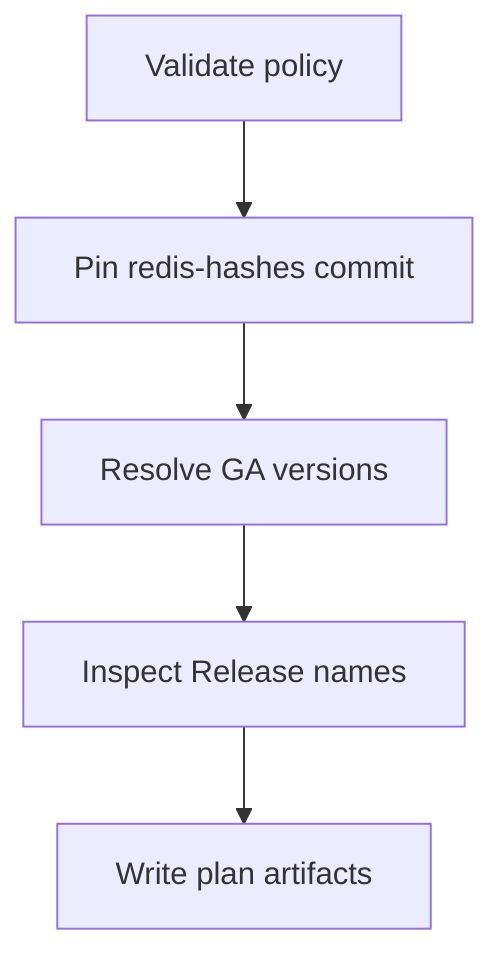

# Multi-platform release design

[简体中文](PLATFORM-DESIGN.zh-CN.md)

This document separates stable release behavior, experimental artifacts, and
backend designs. **Implemented** means that code, CI, validation, native
lifecycle gates, and publication policy exist. **Experimental** means that a
manual build/package path exists but no GitHub Release or production support
is claimed. **Design only** means that no build artifact is claimed.

## Redis release lines

Tracked `X.Y` series are declared in
[`config/release-lines.json`](../config/release-lines.json). The controller
selects the highest stable `X.Y.Z` with an official SHA-256 record for each
enrolled series; it does not rebuild every historical source tarball. Current
configuration enrolls `6.2`, `7.2`, `7.4`, `8.0`, `8.2`, `8.4`, `8.6`,
`8.8`, and `8.10`. The configuration, not this prose list, is authoritative.

Enrollment follows the official
[Redis version-management policy](https://redis.io/docs/latest/operate/oss_and_stack/install/version-mgmt/).
When an enrolled line passes its configured EOL date, automatic planning
stops for that line. A stable series above `new_series_floor` is reported as a
candidate and requires a reviewed configuration change before it can enter a
build plan. Prereleases are excluded.

License review is a release-line gate. According to the official
[Redis license summary](https://redis.io/legal/licenses/), Redis 7.2.x and
earlier use BSD-3-Clause, 7.4.x through 7.8.x use RSALv2/SSPLv1, and Redis 8
and later offer RSALv2, SSPLv1, or AGPLv3. A package must retain the exact
license and notice material from its verified source version. Redis names and
marks remain subject to the official
[trademark policy](https://redis.io/legal/trademark-policy/).

## Platform matrix

| Variant | Architectures | Build baseline | Service backend | Status |
| --- | --- | --- | --- | --- |
| `linux-glibc2.28` | x64, ARM64 | Digest-pinned Rocky Linux 8 user space | systemd | **Implemented** |
| `linux-glibc2.17-legacy` | x64, ARM64 | Digest-pinned manylinux2014 (glibc 2.17) | systemd | **Experimental artifact only** |
| `linux-musl1.2` | x64, ARM64 | Digest-pinned musllinux 1.2 | OpenRC | **Experimental artifact only** |
| `macos12` | x64, ARM64 | Native macOS 15 runners, deployment target 12.0 | launchd | **Experimental artifact only** |
| `windows-msys2` | x64 | Windows Server 2022 runner and MSYS2 | Windows SCM | **Experimental artifact only**; primary Windows backend |
| `windows-cygwin` | x64 | Pinned Cygwin toolchain/runtime | Windows SCM | Design only; compatibility backend |

Only `linux-glibc2.28` rows are controller-enabled. Experimental rows name the
manual `build-experimental.yml` workflow but remain controller-disabled. All
Linux archive designs use `.tar.gz` rather than an RPM, DEB, Snap, or APK and
use the fixed prefix `/usr/local/redis`. The experimental Windows package uses
`.zip` and the fixed prefix `C:\Program Files\Redis-Unofficial`.

### ABI principles

- A glibc 2.28 binary cannot be assumed to run on glibc 2.17. The legacy
  variant must be built separately, and every ELF must be scanned for its
  highest required `GLIBC_*` symbol.
- A legacy libc baseline does not make an end-of-life operating system secure
  or supported.
- musl and glibc are different ABIs and never share an archive. The musl
  backend requires `scanelf`/dependency inspection and real OpenRC lifecycle
  tests.
- `-march=native` is forbidden. x64 and ARM64 use conservative ISA baselines
  unless a separately named optimized variant is introduced.
- macOS architectures are built and tested natively. The deployment target is
  an ABI floor, not a security-support promise.
- An x64 Windows package running under emulation is not ARM64. Native Windows
  ARM64 requires a compatible native toolchain and real service, persistence,
  and load tests on ARM64 Windows.

## Implemented stable Linux package contract

The current profile is `core`: Redis server and command-line binaries are
included, while Redis 8 bundled modules are excluded. A module-enabled profile
requires a distinct variant plus separate compiler, dependency, license,
persistence, and upgrade gates. TLS is disabled.

Every archive has a `redis/` root and contains:

- `PACKAGE-INFO` format 2 and `BUILD-INFO`;
- the Redis binaries and sample configuration;
- install, update, and uninstall scripts;
- the systemd unit and an optional hardening example;
- upstream `LICENSE.txt`;
- `UPSTREAM-CONTRIBUTOR-LICENSE.txt` for Redis 7.4+ and for any older source
  that actually contains `REDISCONTRIBUTIONS.txt`;
- deterministic `UPSTREAM-DEPENDENCY-NOTICES.txt` generated from recognized
  notice files under the verified source tree's `deps/` directory;
- project `THIRD_PARTY_NOTICES.md` and package `README.txt`.

No contributor-license placeholder is generated for an older source that
lacks the upstream file. The dependency-notice collection uses deterministic
path ordering and framed path/length records with bounded file count and
size; it preserves source text without claiming complete legal classification.
Metadata stores hashes for these notice artifacts, or the explicit absence
state where the contributor file is legitimately unavailable.

Key `PACKAGE-INFO` fields include:

```text
PACKAGE_FORMAT=2
PACKAGE_ID=redis-unofficial-builds
REDIS_VERSION=7.4.11
REDIS_SERIES=7.4
BUILD_PROFILE=core
PACKAGE_VARIANT=linux-glibc2.28
PACKAGE_ARCH=x64
OS=linux
LIBC=glibc
MIN_GLIBC=2.28
SERVICE_BACKEND=systemd
INSTALL_PREFIX=/usr/local/redis
UPSTREAM_SOURCE_SHA256=...
UPSTREAM_CONTRIBUTOR_LICENSE_SHA256=...
UPSTREAM_DEPENDENCY_NOTICES_SHA256=...
PATCHSET_SHA256=...
```

The CI builder runs as an unprivileged account in a controlled container,
downloads the official source over HTTPS, verifies its planned SHA-256 before
extraction, runs upstream build/test code, and packages only from a private
staging tree. It refuses UID 0 and refuses a host with a live
`/usr/local/redis`. The packaging repository snapshot is root-owned and
read-only to the builder. DNF packages are resolved from Rocky repositories,
so compiler/runtime details are recorded but bit-for-bit reproducibility is
not claimed.

## Experimental artifact contract

The manual-only workflow first pins and strictly parses an official
`redis/redis-hashes` snapshot, downloads the matching source archive, and
passes the verified archive between jobs. It has repository `contents: read`
permission and no tag, Release, downstream workflow-dispatch API, or
publication step. Artifacts are
retained for seven days and are deliberately outside the stable seven-asset
Release inventory.

The glibc 2.17 packages reuse format 2 plus
`PACKAGE_STATUS=experimental`. The musl, macOS, and Windows packages use
`PACKAGE_FORMAT=3` and `PACKAGE_STATUS=experimental`. Format 3 binds the
source digest, redis-hashes commit, packaging revision, exact platform
identity, reviewed lifecycle assets, and platform-specific packaging patch
set. Validation reads archives without extraction and rejects unexpected
members, traversal, links, special files, unsafe modes, oversized content,
compression bombs, architecture/runtime mismatches, and active `loadmodule`
records.

The manual workflow runs upstream build tests and local Redis protocol smoke
tests for Linux and macOS. Its disposable lifecycle gates exercise both legacy
Linux architectures without systemd, both musl architectures with OpenRC in an
Alpine container, both macOS architectures with launchd on native macOS 15
runners, and the optimized MSYS2 x64 build plus the repository's independent
self-contained SCM wrapper on Windows Server 2022. Those gates cover fresh
install, same-version idempotency, readiness, saved-data reload, ordinary
uninstall recovery, and purge as applicable to each backend.

Stable acceptance still requires a representative booted legacy distribution
with systemd, a booted OpenRC environment, the oldest claimed macOS 12 version,
fault-injected rollback, and the remaining Windows authentication, TLS,
non-ASCII-path, failure, security, and load cases. A successful manual run
therefore leaves every artifact in experimental status.

## Current GitHub Release contract

One numeric Redis `X.Y.Z` tag identifies one Release. The implemented Linux
publisher accepts exactly these seven asset names:

```text
Redis-{version}-linux-glibc2.28-x64.tar.gz
Redis-{version}-linux-glibc2.28-x64.tar.gz.sha256
Redis-{version}-linux-glibc2.28-arm64.tar.gz
Redis-{version}-linux-glibc2.28-arm64.tar.gz.sha256
SHA256SUMS
manifest.json
redis-unofficial-builds-{version}.spdx.json
```

No missing or additional asset is accepted. `SHA256SUMS` hashes the other six
files. `manifest.json` binds source URL/SHA-256, the immutable
`redis-hashes` commit, packaging revision, patch-set checksum, workflow,
profile, architecture, ABI, sizes, and archive digests.

The SPDX 2.3 document describes the verified Redis source and the two archive
packages with `filesAnalyzed=false`. Its declared scope is
`release-package-level`; it must not be presented as a complete file-level or
transitive dependency SBOM.

The workflow creates SLSA provenance attestations for all seven assets and
SPDX attestations for both archives. Before publication it verifies exact
workflow identity, signer/source revision, protected default-branch ref,
predicate type, and denial of self-hosted runners.

### New-Release-only publication

The publisher operates only when neither the tag nor Release exists:

1. both architecture builds and service tests pass;
2. the seven files are created and semantically validated;
3. attestations are generated and verified;
4. a single draft Release is created with all seven files;
5. its REST `target_commitish`, draft state, and exact inventory are read back;
6. every remote numeric asset ID, byte size, and GitHub SHA-256 digest is
   bound to the verified local file, then all assets are downloaded,
   semantically validated, and attestation-verified again;
7. immediately before publication, the same draft identity, draft/prerelease
   state, tag OID, asset IDs, sizes, digests, and exact inventory are read back
   again; and
8. the draft is published by numeric Release ID with `latest=false`, after
   which the published identities are read back and every asset is downloaded,
   semantically validated, and attestation-verified again.

The automation never adds to, overwrites, deletes from, or completes an
existing Release. A draft, prerelease, incomplete, legacy-contract, or
extra-asset Release blocks automation and requires maintainer review. An
existing exact Release is downloaded, semantically validated, checked against
its tag revision, and attestation-verified before the build is skipped.
A manual nonpublishing `force_rebuild` may produce Actions artifacts after
that validation, but cannot mutate or republish the Release.

A failed draft publication can leave a draft and tag. Later runs refuse to
mutate them rather than attempting automatic rollback or repair. GitHub does
not provide an atomic compare-and-publish operation for all draft fields, so
this project policy complements rather than replaces repository-level
Immutable Releases and restricted Release write access.

### External repository protections

YAML references, but cannot configure, the required protections. Repository
administrators must:

- protect the default branch with a branch protection rule or ruleset; and
- configure the `release` Environment with required reviewers and deployment
  branch restrictions that allow only the protected default branch;
- enable repository-level Immutable Releases before production publication;
  and
- restrict Release write access to the reviewed workflow and trusted
  maintainers.

The release job checks `github.ref_protected` and the default-branch ref before
receiving scoped `contents: write`, `id-token: write`, `attestations: write`,
and `artifact-metadata: write` permissions. Normal planning and building retain
read-only repository access.

## Linux lifecycle contract

The implemented lifecycle scripts require Bash, GNU userland utilities,
`flock` and `setpriv` from util-linux, account-management tools, and systemd
when service mode is selected. Distribution package names are documented in
the main [README](../README.md).

### Filesystem and account trust

- Lifecycle scripts run as root but require the extracted package tree to be
  root-owned, not group/world-writable, without extended ACLs, unexpected
  symlinks, multiple hard links, or special files. Regular files may not have
  setuid, setgid, or sticky mode bits. Directories are constrained by ownership
  and writability rather than a blanket special-mode-bit prohibition.
- A new `redis` account is non-login and has only the `redis` group. An
  existing account is reused only with nonzero UID/GID, that primary and sole
  group, a `nologin`/`false` shell, and a canonical absolute home path.
  Current-format state pins UID, primary GID, home, shell, and the
  supplementary-group set. Migration from older
  state clears user/group creation ownership because the older format cannot
  prove the complete identity.
- With current-format state, project-created accounts are removed on purge
  only when UID, primary GID, home, shell, and absence of supplementary groups
  exactly match the recorded identity; the group must retain its recorded GID
  and have no unexpected explicit members. Older state without the complete
  identity record conservatively preserves both account and group. Existing
  accounts are retained.
- Recursive operations reject a mount at the target or any descendant.
- Install/update copies do not preserve SELinux contexts or extended
  attributes from staging. The target host must apply its own policy and
  relabel when necessary.

### Configuration and service trust

A fresh configuration sets `port 0`, uses
`/usr/local/redis/data/redis.sock` with mode `0770`, and stores data under
`/usr/local/redis/data`. Adoption and update preserve existing configuration
and data.

Configuration validation recursively follows at most 64 unique `include`
files and checks files referenced by `loadmodule` and `aclfile`. References
may be absolute or relative to `/usr/local/redis` but cannot contain
whitespace, globs, or backslashes. Path components cannot be symlinks; parent
chains and single-link regular files must be root controlled and free of
extended ACLs. Module arguments are permitted after the validated module path.

This contract makes a managed `aclfile` root-owned and not group/world-writable;
the Redis service account therefore cannot use `ACL SAVE` to update it.
Administrators must deploy ACL changes offline as root and restart Redis, or
use a site-controlled equivalent that restores trusted ownership and modes
before any root lifecycle operation. Relaxing the file permissions for
runtime `ACL SAVE` and then invoking package maintenance is outside the
supported trust contract.

The base systemd unit runs Redis in the foreground. A foreign
`redis.service` is rejected unless `--force-service` is supplied and the unit
is `inactive` or `failed`. Active or reloading foreign units are always
refused. A disabled foreign unit is enabled after replacement and rollback
restores its disabled state; an enabled foreign unit remains enabled.
Effective managed units and drop-ins are checked for the exact
identity, command, working directory, environment/credential isolation,
execution-hook absence, and `NoNewPrivileges` contract.

`--no-service` is a complete managed installation mode: it still manages the
account, configuration/data directories, package metadata, and lifecycle
state, but neither requires nor registers systemd. Because no service manager
is available to stop Redis, the administrator must stop every process whose
executable is exactly `/usr/local/redis/bin/redis-server` before update or
uninstall; maintenance fails closed while any such process remains.

### Update and removal

- Install, update, and uninstall share an exclusive lock.
- Update validates the new binary before stopping Redis, preserves
  configuration/data, and backs up programs, configuration, units, notices,
  metadata, and state under `/usr/local/redis-backups/`.
- Readiness requires a Redis protocol response. Failure or handled termination
  signals roll back program and service state.
- The automatic backup excludes Redis data. Production maintenance requires
  an independent application-consistent snapshot.
- Downgrades are refused unless `--allow-downgrade` is explicitly supplied.
  This also applies when an older package is reinstalled over lifecycle state
  retained by an ordinary uninstall; an independent data snapshot is required
  before explicitly permitting either operation.
- Uninstall preserves configuration, data, state, account, and backups by
  default. `--purge` removes the fixed prefix subject to account and mount
  safety checks.

## Experimental and designed backends

### glibc 2.17 legacy

This is a separately named experimental compatibility artifact, not a
replacement for the implemented baseline. Its builder uses digest-pinned
manylinux2014 images and rejects any ELF requiring a symbol newer than
`GLIBC_2.17`. The manual gate executes fresh install, update, saved-data
reload, ordinary-uninstall recovery, and purge for both architectures in the
matching manylinux2014/CentOS 7 user space using `--no-service`. Stable
acceptance still requires a maintainable toolchain/sysroot, execution on a
representative supported legacy operating system, systemd lifecycle tests,
and rollback fault injection. Release notes must state that an old ABI does
not provide operating-system security maintenance.

### musl and OpenRC

The experimental musl archive is built in digest-pinned musllinux 1.2 images,
must carry the musl interpreter, must contain no `GLIBC_*` references, and
includes a distinct OpenRC lifecycle contract. The manual gate tests both
architectures in a disposable Alpine container with OpenRC: fresh and repeated
install, service restart, saved-data reload, ordinary uninstall, update-based
recovery, and purge. This container does not boot under OpenRC as PID 1, so
stable acceptance still needs a booted OpenRC environment, broader native
dependency and shell/runtime compatibility coverage, and rollback fault
injection. The OpenRC scripts cannot depend on systemd and require a distinct
service/state contract.

### macOS

Each experimental architecture is built on a native runner with deployment
target 12.0. Archive validation checks Mach-O architecture, deployment target,
and approved system-library paths. The launchd backend manages a recorded
non-login account, preserves configuration/data, verifies PING readiness, and
includes update/rollback/uninstall scripts. The manual gate runs fresh and
repeated install, launchd restart, saved-data reload, ordinary-uninstall
recovery, and purge for both architectures on native macOS 15 runners. Stable
acceptance still requires running those paths on the oldest claimed macOS 12
version and rollback fault injection. A universal archive is permitted only
after both slices independently pass.

### Windows

The Windows design explicitly references Apache-2.0-licensed
[`redis-windows/redis-windows`](https://github.com/redis-windows/redis-windows)
at commit
[`17fd667560f7903820dcabeebb9d20ade1159fe9`](https://github.com/redis-windows/redis-windows/commit/17fd667560f7903820dcabeebb9d20ade1159fe9).
The reference is fixed so design conclusions and issue mappings are
reproducible. This repository's Windows wrapper is an independent
implementation and incorporates no source file from that project. Attribution
and any future incorporation requirements are recorded
in [`THIRD_PARTY_NOTICES.md`](../THIRD_PARTY_NOTICES.md).

MSYS2 is the experimental primary backend and Cygwin remains design only.
Their path conversion rules cannot be shared blindly: MSYS2 uses `/c/...`,
while Cygwin uses `/cygdrive/c/...`. The service wrapper must keep Redis in
foreground mode, validate configuration paths, propagate startup/child-exit
failure to the Service Control Manager, perform real readiness checks, use
bounded graceful shutdown and process-tree fallback, exclude credentials from
arguments/logs, record diagnostic output, and maintain protected installation
state under the fixed prefix. Backups use
`C:\ProgramData\Redis-Unofficial\Backups`. The current experiment supports the
default unauthenticated loopback endpoint; authenticated shutdown remains an
explicit stable-acceptance gate.

The current Windows Server 2022 gate covers fresh install, same-version update,
PING readiness, explicit `SAVE`, SCM restart with key reload, ordinary
uninstall retention, update-based service recovery, and purge at the fixed
default path. Stable Windows acceptance still requires real tests for spaces
and non-ASCII paths, invalid configuration, port conflicts, BGSAVE/AOF,
authenticated or TLS shutdown, unexpected child exit, Sentinel, rollback fault
injection, and bounded load. Native executables require PE VERSIONINFO. Release
builds use optimization rather than `-O0` and publish measured limits without
promising Linux-equivalent behavior through a POSIX layer. See
[Windows issue coverage](WINDOWS-ISSUE-COVERAGE.md).

## Version resolution and build separation

The [release controller](RELEASE-CONTROLLER.md) is permanently constrained by
the checked-in `controller_mode=plan_only` setting:



It does not download Redis source, execute package code, call a build
workflow, create a tag, or publish a Release. Release-name inventory is only a
planning signal; content and attestations are validated by the publish-capable
Linux workflow.

## Release gates

An implemented stable row requires:

- official source SHA-256 tied to a recorded immutable `redis-hashes` commit;
- applicable upstream license, contributor text, dependency notices, and
  project notices;
- compiler/runtime, packaging revision, and patch-set hashes in metadata;
- upstream tests plus architecture, dependency, ABI, and smoke checks;
- fresh install, readiness, update, rollback, persistence, adoption,
  uninstall, purge, account reuse, mount, and foreign-service safety tests;
- English and Simplified Chinese lifecycle paths;
- default local-socket-only configuration and preservation of adopted
  listener/authentication/persistence/module/include settings;
- exact seven-asset metadata validation and complete `SHA256SUMS`;
- release-package-level SPDX validation;
- provenance and SPDX attestation generation plus constrained verification;
- new-draft-only publication, exact inventory readback, download validation,
  and one-way publication; and
- protected-default-branch and `release` Environment approval.

An experimental or design-only row cannot be included in an implemented
Release merely because its workflow or asset name is present in configuration.
