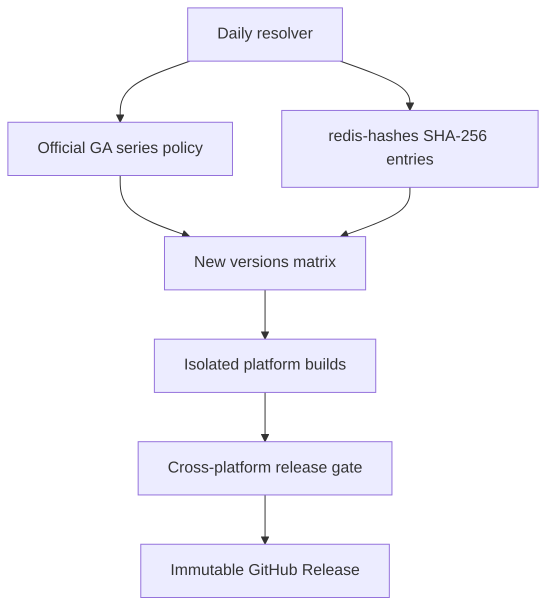

# Multi-platform release design

[简体中文](PLATFORM-DESIGN.zh-CN.md)

This document is the target architecture. A row marked **designed** is not a
claim that its packages already exist. The current implemented path remains
`linux-glibc2.28`; every new backend must pass the gates below before it is
published as stable.

## Release lines

"All current major versions" means every Redis Open Source GA `X.Y` line on
the official version-management page, not every historical tarball in the
download archive. As observed on 2026-08-20, the initial build set is:

| Series | Latest official patch | Release type |
| --- | --- | --- |
| 6.2 | 6.2.24 | Extended |
| 7.2 | 7.2.16 | Extended |
| 7.4 | 7.4.11 | Extended |
| 8.0 | 8.0.6 | Standard |
| 8.2 | 8.2.9 | Extended |
| 8.4 | 8.4.6 | Standard |
| 8.6 | 8.6.6 | Standard |
| 8.8 | 8.8.2 | Standard |
| 8.10 | 8.10.1 | Standard |

The live list is declared in [`config/release-lines.json`](../config/release-lines.json).
The versions in this table are informational and may become stale.

Redis 6.0, 7.0, and older lines remain downloadable but are not in the
official current GA set. They are therefore excluded from automatic stable
publishing. A maintainer can still request a one-off EOL build, which must be
labelled unsupported and must not replace a maintained release.

## Package matrix

All Linux packages are `.tar.gz` archives rather than RPM, DEB, Snap, or APK.
Every Linux variant installs to `/usr/local/redis` by default.

| Variant | Architectures | Controlled build baseline | Service backend | Default prefix | Target status |
| --- | --- | --- | --- | --- | --- |
| `linux-glibc2.28` | x64, arm64 | Rocky Linux 8 user space | systemd | `/usr/local/redis` | Implemented |
| `linux-glibc2.17-legacy` | x64, arm64 | manylinux2014-compatible glibc 2.17 sysroot | systemd | `/usr/local/redis` | Designed, legacy |
| `linux-musl1.2` | x64, arm64 | Oldest still-supported Alpine branch; initially 3.21 | OpenRC | `/usr/local/redis` | Designed |
| `macos12` | x64, arm64 | Native runners with deployment target 12.0 | launchd | `/usr/local/redis` | Designed |
| `windows-msys2` | x64 | Pinned MSYS2 toolchain and runtime DLL set | Windows SCM | `C:\Program Files\Redis` | Designed, primary Windows |
| `windows-cygwin` | x64 | Pinned Cygwin toolchain and runtime DLL set | Windows SCM | `C:\Program Files\Redis` | Designed, compatibility |

There is no stable native Windows ARM64 row yet. The referenced Windows
project and its two POSIX compatibility runtimes are x64-oriented; emitting an
x64 package that merely runs under emulation would be misleading. Native
Windows ARM64 can be added after an ARM64 runtime/toolchain exists and the full
service, persistence, and load test suite passes on ARM64 Windows hardware.

### ABI rules

- `linux-glibc2.28` and `linux-glibc2.17-legacy` are separate because an ELF
  binary cannot use a newer versioned glibc symbol and still run on an older
  glibc. Every packaged ELF is scanned for its highest `GLIBC_*` requirement.
- The 2.17 build is explicitly **legacy**. Compatibility with an old libc does
  not make an end-of-life operating system secure or supported.
- musl is a different libc, so it never shares an archive with a glibc build.
  The build uses the oldest still-supported Alpine baseline and moves that
  baseline forward before the branch reaches EOL. `scanelf`, `ldd`, and an
  OpenRC integration test verify the package.
- `-march=native` is forbidden. x64 targets the conservative x86-64 baseline;
  arm64 targets the baseline AArch64 ISA unless a separately named optimized
  package is introduced.
- macOS is built natively for each architecture, not as an untested universal
  merge. `MACOSX_DEPLOYMENT_TARGET=12.0`, `otool`, and architecture checks are
  release gates.

## Archive contract

Every asset contains a machine-readable `PACKAGE-INFO` and `BUILD-INFO`, the
upstream Redis license, this project's notices, installation scripts, service
definition, and configuration samples. The manifest adds these fields to the
existing Linux schema:

```text
PACKAGE_FORMAT=2
PACKAGE_ID=redis-unofficial-builds
REDIS_VERSION=7.4.11
REDIS_SERIES=7.4
PACKAGE_VARIANT=linux-glibc2.17-legacy
PACKAGE_ARCH=x64
OS=linux
LIBC=glibc
MIN_GLIBC=2.17
SERVICE_BACKEND=systemd
INSTALL_PREFIX=/usr/local/redis
UPSTREAM_SOURCE_SHA256=...
PATCHSET_SHA256=...
```

Asset names are deterministic:

```text
Redis-{version}-{variant}-{arch}.tar.gz
Redis-{version}-{variant}-{arch}.tar.gz.sha256
Redis-{version}-{variant}-{arch}.zip
Redis-{version}-{variant}-{arch}.zip.sha256
```

One GitHub Release tag equals one Redis patch version and contains every
platform asset that passed its stable gate. Assets are never silently
overwritten. A release-level `manifest.json`, `SHA256SUMS`, SPDX SBOM, and
build provenance describe which matrix rows succeeded or were intentionally
unsupported.

## Installation lifecycle

Each backend implements the same observable contract:

1. Preflight OS, architecture, ABI, package metadata, executable version,
   service manager, target ownership, and configuration before mutation.
2. Keep programs, configuration, data, logs, and installation state distinct.
3. Preserve configuration and data during update; back up programs and service
   definitions; use an atomic or rollback-capable replacement.
4. Consider the update successful only after Redis becomes ready and a PING
   succeeds, not merely when the service manager reports "started".
5. Uninstall preserves configuration and data by default. `--purge` removes
   only objects that the signed installation state proves this project made.
6. Never replace an unrelated Redis service or account without an explicit
   adoption/force option.

Linux and macOS scripts use locale-neutral POSIX/system commands and provide
English and Simplified Chinese messages. Windows PowerShell and service help
provide the same two languages. Automation consumes exit codes and JSON/key
value state; it never parses translated human-readable service output.

### Service-specific layout

| Backend | Programs | Mutable state | Important rule |
| --- | --- | --- | --- |
| systemd | `/usr/local/redis` | prefix `conf/`, `data/`, `logs/` | Unit runs Redis in foreground and respects config paths |
| OpenRC | `/usr/local/redis` | prefix `conf/`, `data/`, `logs/` | POSIX `sh`; no Bash or systemd dependency |
| launchd | `/usr/local/redis` | prefix `conf/`, `data/`, `logs/` | LaunchDaemon runs as a recorded `_redis` account |
| Windows SCM | `C:\Program Files\Redis` | `C:\ProgramData\Redis` | Service command contains no mutable path overrides or secrets |

## Windows backend

The Windows implementation builds the official Redis source plus a small,
versioned Windows patch set. Its design explicitly references
[`redis-windows/redis-windows`](https://github.com/redis-windows/redis-windows),
which is Apache-2.0 licensed. See [`THIRD_PARTY_NOTICES.md`](../THIRD_PARTY_NOTICES.md)
and the [issue coverage](WINDOWS-ISSUE-COVERAGE.md).

MSYS2 is the primary backend; Cygwin is an additional compatibility artifact.
They have separate runtime adapters and must never share path-conversion code:

- MSYS2 drive paths use its own conversion (`C:\x` to `/c/x`).
- Cygwin drive paths use `/cygdrive/c/x`.
- The wrapper invokes the matching runtime's `cygpath` when conversion is
  unavoidable. Service installation normally passes only the absolute config
  path; `dir`, `logfile`, TLS, ACL, and module paths stay in that config.

The service wrapper must:

- validate the config and create approved data/log directories before
  registration;
- force `daemonize no`, own the child process tree, and report startup failure
  to the Service Control Manager;
- wait for a real Redis readiness check rather than a fixed 100 ms delay;
- stop with `redis-cli` connection arguments only, then wait and use a bounded
  process-tree fallback; passwords must not appear in the service command line
  or logs;
- stop/fail the Windows service when the Redis child exits unexpectedly and
  configure bounded SCM recovery actions;
- log child stdout/stderr and the effective config path for diagnosis;
- embed Redis version and package revision in PE VERSIONINFO for every EXE;
- support a distinct Sentinel service mode and service name; and
- use `C:\ProgramData\Redis\install-state.json` to protect update, rollback,
  adoption, and uninstall operations.

Windows stable CI includes spaces and non-ASCII paths, service restart,
invalid-config failure propagation, graceful shutdown, persistence across
restart, BGSAVE, port-conflict diagnostics, Sentinel, and bounded load tests.
Performance uses an optimized release build (`-O2`, never the referenced
workflow's `-O0`) and publishes benchmark results without promising Linux-like
performance through a POSIX compatibility layer.

## Version discovery and publishing



The resolver runs daily and on manual dispatch:

1. Read `config/release-lines.json`.
2. Fetch `redis/redis-hashes` over HTTPS and select the highest stable `X.Y.Z`
   for each configured `X.Y`; RC, beta, and milestone tarballs are ignored.
3. Require the official SHA-256, download the official source tarball, and
   verify it before extraction.
4. Compare the expected asset manifest with existing releases. Build only
   missing versions or explicitly requested rebuilds.
5. Build with read-only repository permissions. A separate aggregator job,
   after all required gates pass, receives `contents: write` and publishes the
   immutable release.

Every patch for an enrolled series is therefore automatic. A brand-new `X.Y`
series is different: it may change the license, bundled components, compiler,
or Windows patch set. The resolver builds an unpublished candidate and opens a
small configuration PR. Once that PR passes and is merged, later patches in
that series are automatic. This avoids silently distributing an unreviewed new
product line while still detecting it without manual polling.

Failed scheduled builds do not delete or replace the previous release. They
retain logs/artifacts and open or update one tracking issue keyed by Redis
version and matrix row.

## Required release gates

Common gates for every version and stable platform row:

- upstream SHA-256 verification and reproducible source URL;
- compiler/runtime versions and patch hashes recorded in `BUILD-INFO`;
- upstream `make test` where supported;
- binary architecture, dependency, and ABI inspection;
- PING, SET/GET, expiry, persistence/restart, and clean shutdown;
- fresh install, update from the previous patch in the same series, rollback,
  uninstall-preserve, and purge safety tests;
- custom configuration/data/log paths containing spaces and non-ASCII text;
- English and Chinese help/error paths;
- generated checksums, SBOM, and provenance validation.

Platform-only gates may fail one experimental row without hiding that result,
but a stable row may not be published as successful when its service or data
integrity tests fail.

## Implementation order

1. Replace the fixed 7.4 resolver with the multi-series release controller and
   manifest aggregation while keeping the working glibc 2.28 build.
2. Add glibc 2.17 and musl/OpenRC Linux builders and service tests.
3. Add native x64/arm64 macOS builds and launchd lifecycle scripts.
4. Add the Windows wrapper/runtime adapters and turn the issue-coverage table
   into regression tests; publish Windows as prerelease until all stable gates
   pass.
5. Enable automatic stable publication per series and new-series candidate PRs.
