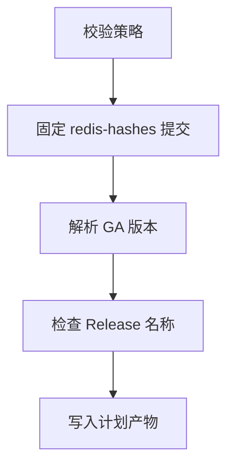

# 多平台发布方案

[English](PLATFORM-DESIGN.md)

本文明确区分稳定发布能力、实验性预发布和后端设计。“已实现”表示代码、CI、校验、
原生生命周期门禁和稳定发布策略均已存在；“实验性”表示已有手工构建/打包路径，只有
全部验收门禁通过后才能进入使用独立 Tag 的 GitHub 预发布，但不宣称生产支持；
“仅设计”表示不宣称存在构建产物。

## Redis 发布系列

跟踪的 `X.Y` 系列声明在
[`config/release-lines.json`](../config/release-lines.json)。控制器为每个已登记系列
选择存在官方 SHA-256 记录的最高稳定 `X.Y.Z`，不会重新构建所有历史源码包。当前
配置登记 `6.2`、`7.2`、`7.4`、`8.0`、`8.2`、`8.4`、`8.6`、`8.8`、
`8.10`；最终以配置文件为准。

系列登记依据 Redis
[官方版本管理策略](https://redis.io/docs/latest/operate/oss_and_stack/install/version-mgmt/)。
已登记系列超过配置的 EOL 日期后停止自动计划。高于 `new_series_floor` 的新稳定
系列只会列为候选项，必须经过配置审查后才能进入构建计划。预发布版本不纳入计划。

许可证审查是系列门禁。根据 Redis 官方
[许可说明](https://redis.io/legal/licenses/)，7.2.x 及更早版本使用
BSD-3-Clause，7.4.x 至 7.8.x 使用 RSALv2/SSPLv1，Redis 8 及以上可选择
RSALv2、SSPLv1 或 AGPLv3。包必须保留已校验版本的准确许可证和 notices。
Redis 名称与标识仍受官方
[商标政策](https://redis.io/legal/trademark-policy/)约束。

## 平台矩阵

| 包变体 | 架构 | 构建基线 | 服务后端 | 状态 |
| --- | --- | --- | --- | --- |
| `linux-glibc2.28` | x64、ARM64 | 按摘要固定的 Rocky Linux 8 用户态 | systemd | **已实现** |
| `linux-glibc2.17-legacy` | x64、ARM64 | 按摘要固定的 manylinux2014（glibc 2.17） | systemd | **实验性预发布** |
| `linux-musl1.2` | x64、ARM64 | 按摘要固定的 musllinux 1.2 | OpenRC | **实验性预发布** |
| `macos12` | x64、ARM64 | 原生 macOS 15 Runner、部署目标 12.0 | launchd | **实验性预发布** |
| `windows-msys2` | x64 | Windows Server 2022 Runner 与 MSYS2 | Windows SCM | **实验性预发布**；Windows 主后端 |

只有 `linux-glibc2.28` 行已启用控制器。实验性行指向手工
`build-experimental.yml`，但控制器仍禁用。所有 Linux 方案均使用 `.tar.gz`，不依赖
RPM、DEB、Snap 或 APK，固定前缀为 `/usr/local/redis`。实验性 Windows 包使用
`.zip` 和固定目录 `C:\Program Files\Redis-Unofficial`。

当前运行身份清理之前创建的实验性安装会被新更新脚本明确拒绝。请先备份配置与
数据，使用已安装包内的生命周期脚本卸载，再执行全新安装。

### ABI 原则

- glibc 2.28 二进制不能假定可在 glibc 2.17 上运行。legacy 包必须单独构建，并
  扫描每个 ELF 的最高 `GLIBC_*` 符号。
- 兼容旧 libc 不代表已停止维护的操作系统安全或受支持。
- musl 与 glibc 是不同 ABI，不能共用包。musl 后端需要原生依赖检查和真实 OpenRC
  生命周期测试。
- 禁止 `-march=native`。除非增加独立命名的优化变体，否则 x64 与 ARM64 使用保守
  指令集基线。
- macOS 每个架构分别原生构建和测试。部署目标是 ABI 下限，不是安全维护承诺。
- 在模拟层运行的 x64 Windows 包不能标记为 ARM64。原生 Windows ARM64 必须具备
  兼容原生工具链，并在 ARM64 Windows 上完成服务、持久化及负载测试。

## 已实现稳定 Linux 包约定

当前使用 `core` 配置：包含 Redis 服务端和命令行程序，不包含 Redis 8 捆绑模块。
模块版必须使用独立变体，并设置独立编译器、依赖、许可证、持久化和升级门禁。
TLS 未启用。

每个包以 `redis/` 为顶层，并包含：

- 第 2 版 `PACKAGE-INFO` 和 `BUILD-INFO`；
- Redis 二进制及配置样例；
- 安装、更新和卸载脚本；
- systemd 单元和可选加固样例；
- 上游 `LICENSE.txt`；
- Redis 7.4 及以上版本必有 `UPSTREAM-CONTRIBUTOR-LICENSE.txt`；更早版本仅在
  源码确有 `REDISCONTRIBUTIONS.txt` 时包含；
- 从已校验源码树 `deps/` 中识别的 notices 确定性生成
  `UPSTREAM-DEPENDENCY-NOTICES.txt`；
- 项目 `THIRD_PARTY_NOTICES.md` 和包内 `README.txt`。

更早源码缺少贡献者文件时不会生成占位许可。依赖 notices 按路径确定排序，并使用
路径/长度 framing，限制文件数和大小；它保留上游文本，但不宣称已完成法律分类。
元数据会记录这些文件的哈希；贡献者文件合法缺失时记录明确的 absent 状态。

`PACKAGE-INFO` 关键字段示例：

```text
PACKAGE_FORMAT=2
PACKAGE_ID=redis-unofficial-builds
REDIS_VERSION=7.4.11
REDIS_SERIES=7.4
BUILD_PROFILE=core
PACKAGE_VARIANT=linux-glibc2.28
PACKAGE_ARCH=x64
OS=linux
LIBC=glibc
MIN_GLIBC=2.28
SERVICE_BACKEND=systemd
INSTALL_PREFIX=/usr/local/redis
UPSTREAM_SOURCE_SHA256=...
UPSTREAM_CONTRIBUTOR_LICENSE_SHA256=...
UPSTREAM_DEPENDENCY_NOTICES_SHA256=...
PATCHSET_SHA256=...
```

CI 构建器以无特权账号在受控容器中运行，通过 HTTPS 下载官方源码，在解压前校验
计划中的 SHA-256，执行上游构建/测试代码，并只从私有暂存树打包。脚本拒绝 UID 0
以及存在生产 `/usr/local/redis` 的主机。打包仓库快照由 root 所有且对构建账号
只读。DNF 依赖从 Rocky 软件源动态解析，因此记录编译器/运行库信息，但不宣称
逐字节可复现。

## 实验性 artifact 约定

仅手工触发的工作流先固定并严格解析官方 `redis/redis-hashes` 快照，下载对应源码包，
再把已校验源码传给各构建 Job。仓库权限只有 `contents: read`，没有 Tag、Release、
下游工作流分发 API 或发布步骤。artifact 保留 7 天，明确不属于稳定 Release 的 7 产物清单。

glibc 2.17 包沿用第 2 版格式并增加 `PACKAGE_STATUS=experimental`；musl、macOS 和
Windows 使用 `PACKAGE_FORMAT=3` 与 `PACKAGE_STATUS=experimental`。第 3 版元数据
绑定源码摘要、redis-hashes 提交、打包提交、精确平台身份、经审查生命周期文件和
平台补丁集。校验器不解压读取包，拒绝多余成员、路径穿越、链接、特殊文件、不安全
权限、超大内容、压缩炸弹、架构/运行库不匹配和仍处于启用状态的 `loadmodule`。

手工工作流对 Linux 和 macOS 执行上游构建测试及本地 Redis 协议冒烟。Windows Job
执行以兼容性为重点的 MSYS2 构建，并构建仓库独立实现的自包含 SCM 包装器。
一次性生命周期门禁
分别覆盖两个 legacy Linux 架构的无 systemd 用户态、两个 musl 架构的 Alpine 容器内
OpenRC、两个 macOS 架构在原生 macOS 15 Runner 上的 launchd，以及 Windows Server
2022 上的 SCM。各后端按适用范围验证全新安装、同版本幂等、就绪、已保存数据重载、
普通卸载后的恢复和彻底卸载。

稳定验收仍要求启动了 systemd 的代表性旧发行版、以 OpenRC 引导的环境、声明支持的
最老 macOS 12、故障注入回滚，以及其余 Windows 认证、TLS、非 ASCII 路径、失败、
安全和负载场景。因此即使手工运行成功，这些产物仍保持实验状态。

### 实验性预发布

构建工作流继续保持只读且不能发布。只有同一版本的七个平台 Job 均绑定同一个受保护
默认分支打包提交并全部成功后，维护者才能发布。维护者必须下载所有 artifact，重新
执行每个压缩包的语义校验与相邻校验和验证，并生成一个汇总 `SHA256SUMS`。

预发布 Tag 为 `X.Y.Z-experimental.N`，必须精确包含 15 个产物：七个平台压缩包、
七个相邻 `.sha256` 和覆盖这 14 个文件的 `SHA256SUMS`。发布过程先创建
`latest=false` 的草稿预发布，在正式发布前核对 Tag 提交、状态、精确文件名、大小和
摘要；正式发布后再次下载并复验全部产物。已有 Tag 或 Release 视为不可变输入，绝不
添加、覆盖、删除或补全；替换时必须重新完成全量构建并递增 `N`。实验性预发布不包含
稳定 manifest、SBOM、artifact attestation，也不代表生产支持。

```text
Redis-X.Y.Z-linux-glibc2.17-legacy-x64.tar.gz
Redis-X.Y.Z-linux-glibc2.17-legacy-x64.tar.gz.sha256
Redis-X.Y.Z-linux-glibc2.17-legacy-arm64.tar.gz
Redis-X.Y.Z-linux-glibc2.17-legacy-arm64.tar.gz.sha256
Redis-X.Y.Z-linux-musl1.2-x64.tar.gz
Redis-X.Y.Z-linux-musl1.2-x64.tar.gz.sha256
Redis-X.Y.Z-linux-musl1.2-arm64.tar.gz
Redis-X.Y.Z-linux-musl1.2-arm64.tar.gz.sha256
Redis-X.Y.Z-macos12-x64.tar.gz
Redis-X.Y.Z-macos12-x64.tar.gz.sha256
Redis-X.Y.Z-macos12-arm64.tar.gz
Redis-X.Y.Z-macos12-arm64.tar.gz.sha256
Redis-X.Y.Z-windows-msys2-x64.zip
Redis-X.Y.Z-windows-msys2-x64.zip.sha256
SHA256SUMS
```

## 当前 GitHub Release 约定

一个纯数字 Redis `X.Y.Z` Tag 对应一个 Release。当前 Linux 发布器只接受以下
精确 7 个产物：

```text
Redis-{version}-linux-glibc2.28-x64.tar.gz
Redis-{version}-linux-glibc2.28-x64.tar.gz.sha256
Redis-{version}-linux-glibc2.28-arm64.tar.gz
Redis-{version}-linux-glibc2.28-arm64.tar.gz.sha256
SHA256SUMS
manifest.json
redis-unofficial-builds-{version}.spdx.json
```

缺少或多出任何产物都会失败。`SHA256SUMS` 校验其余 6 个文件。
`manifest.json` 绑定源码 URL/SHA-256、不可变 `redis-hashes` 提交、打包提交、
补丁集校验和、工作流、构建配置、架构、ABI、大小和压缩包摘要。

SPDX 2.3 文件以 `filesAnalyzed=false` 描述已校验 Redis 源码和两个压缩包，其范围
明确为 `release-package-level`，不能宣传为完整文件级或传递依赖 SBOM。

工作流为 7 个产物生成 SLSA 来源证明，并为两个压缩包生成 SPDX 证明。发布前会验证
准确工作流身份、签名者/源码提交、受保护默认分支 ref、predicate 类型，并拒绝
自托管 Runner 证明。

### 只发布全新 Release

发布器只在 Tag 和 Release 均不存在时工作：

1. 两个架构构建及服务测试全部通过；
2. 创建并按语义校验 7 个文件；
3. 生成并验证证明；
4. 一次创建包含所有 7 个文件的草稿 Release；
5. 通过 REST 回读草稿的 `target_commitish`、状态和精确产物清单；
6. 把每个远端产物的数字 ID、字节数和 GitHub SHA-256 摘要绑定到已校验本地文件，
   再下载全部产物并重复语义校验和证明验证；
7. 临发布前再次回读并核对同一草稿身份、草稿/预发布状态、Tag OID、产物 ID、
   字节数、摘要和精确清单；
8. 按数字 Release ID 正式发布并设置 `latest=false`，随后回读正式发布身份，
   再次下载全部产物并重复语义及证明校验。

自动化绝不向已有 Release 添加、覆盖、删除产物，也不会补全它。已有草稿、预发布、
残缺、旧约定或额外产物 Release 都会阻塞自动化并要求维护者审查。已有精确 Release
会被下载、按语义校验、检查 Tag 提交并验证证明，然后跳过构建。
手工指定且不发布的 `force_rebuild` 可在完成校验后生成 Actions 产物，但不能修改
或重新发布该 Release。

发布失败可能留下草稿和 Tag；后续运行会拒绝修改，而不会自动回滚或修复。GitHub
没有覆盖全部草稿字段的原子“比较并发布”操作，因此该项目策略用于补充而不是替代
仓库级 Immutable Releases 和受限的 Release 写权限。

### 仓库外部保护

工作流 YAML 只能引用，不能创建所需保护。仓库管理员必须：

- 使用分支保护规则或 ruleset 保护默认分支；
- 为 `release` Environment 设置必需审核人和部署分支限制，只允许受保护默认分支；
- 生产发布前启用仓库级 Immutable Releases；
- 把 Release 写权限限制在经审查的工作流和可信维护者。

发布任务在获得受限的 `contents: write`、`id-token: write`、
`attestations: write`、`artifact-metadata: write` 前，会检查默认分支 ref 和
`github.ref_protected`。普通计划和构建仍保持只读仓库权限。

## Linux 生命周期约定

已实现脚本依赖 Bash、GNU 常用命令、util-linux 的 `flock`/`setpriv`、账号管理
工具，以及服务模式下的 systemd。发行版软件包名见主 [README](../README.zh-CN.md)。

### 文件系统与账号信任

- 生命周期脚本以 root 运行，但要求解压后的包树由 root 所有、组和其他用户不可写，
  没有扩展 ACL、异常符号链接、多硬链接或特殊文件。普通文件不得带 setuid、setgid 或
  sticky 特殊权限位；目录按所有者和可写性约束，不统一禁止特殊权限位。
- 新建 `redis` 账号禁止登录且仅属于 `redis` 组。已有账号仅在 UID/GID 非 0、
  `redis` 为主组和唯一所属组、Shell 为 `nologin`/`false` 且 home 是规范绝对路径时
  复用。当前格式状态固定记录 UID、主 GID、home、shell 和附加组集合。旧格式状态
  迁移时会清除用户/组创建归属，因为旧格式无法证明完整身份。
- 对当前格式状态，彻底卸载只在项目创建的账号仍精确匹配已记录 UID、主 GID、
  home、shell 且没有附加组时删除账号；用户组必须保持记录的 GID，且不能出现非
  预期的显式成员。缺少完整身份记录的旧状态会保守地保留用户和组；系统已有账号
  始终保留。
- 递归操作在目标或任一后代是挂载点时拒绝执行。
- 安装/更新不会从暂存目录保留 SELinux context 或扩展属性；目标主机需要按自身
  策略应用标签，必要时重标记。

### 配置与服务信任

新配置设置 `port 0`，使用权限 `0770` 的
`/usr/local/redis/data/redis.sock`，数据目录为 `/usr/local/redis/data`。接管和
更新保留已有配置及数据。

配置校验递归跟踪最多 64 个唯一 `include` 文件，并检查 `loadmodule`、`aclfile`
引用。引用可以为绝对路径或相对于 `/usr/local/redis`，但不得包含空白、glob 或
反斜杠。路径组件不得为符号链接；父目录链和单硬链接普通文件必须由 root 安全控制
且没有扩展 ACL。已验证模块路径之后可以保留模块参数。

该约定使受管 `aclfile` 由 root 所有且组和其他用户不可写，Redis 服务账号因此不能
使用 `ACL SAVE` 更新它。管理员必须以 root 离线部署 ACL 变更并重启 Redis，或使用
等效的站点流程，在任何 root 生命周期操作前恢复可信所有权和权限。为运行时
`ACL SAVE` 放宽文件权限后再执行包维护，不属于支持的信任约定。

基础 systemd 单元以前台模式运行 Redis。外部 `redis.service` 默认拒绝；
`--force-service` 也只允许替换 `inactive` 或 `failed` 单元，`active` 或
`reloading` 外部单元始终拒绝。替换 disabled 外部单元后会启用新的受管单元，回滚
会恢复其 disabled 状态；enabled 外部单元保持启用。受管服务的有效单元和 drop-in
会校验准确身份、命令、工作目录、环境/凭据隔离、无执行钩子及
`NoNewPrivileges` 约定。

`--no-service` 是完整的受管安装模式：仍会管理账号、配置/数据目录、包元数据和
生命周期状态，但不要求或注册 systemd。由于没有服务管理器负责停止 Redis，更新
或卸载前必须由管理员停止所有可执行文件精确为
`/usr/local/redis/bin/redis-server` 的进程；只要仍有此类进程，维护操作就会拒绝。

### 更新与删除

- 安装、更新和卸载共用排他锁。
- 更新在停止 Redis 前校验新二进制，保留配置/数据，并把程序、配置、单元、notices、
  元数据和状态备份到 `/usr/local/redis-backups/`。
- Redis 协议响应是就绪条件；启动失败或收到可处理终止信号会回滚程序和服务状态。
- 自动备份不包含 Redis 数据；生产维护需要单独的应用一致快照。
- 默认拒绝降级，只有明确使用 `--allow-downgrade` 才允许。普通卸载保留状态后，
  使用较旧包重新安装也遵循相同门禁；明确允许任一降级操作前必须另做数据快照。
- 普通卸载保留配置、数据、状态、账号和备份；`--purge` 在账号和挂载安全检查后
  删除固定前缀。

## 实验性后端

### glibc 2.17 legacy

该包是独立命名的实验性兼容变体，不替代已实现基线。构建器使用按摘要固定的
manylinux2014，并拒绝任何要求高于 `GLIBC_2.17` 符号的 ELF。手工门禁在对应的
manylinux2014/CentOS 7 用户态中，以 `--no-service` 对两个架构测试全新安装、更新、
已保存数据重载、普通卸载后的恢复和彻底卸载。稳定验收仍要求可维护的工具链/sysroot、
代表性且仍受支持的旧操作系统、systemd 生命周期测试和故障注入回滚。说明必须明确
旧 ABI 不提供操作系统安全维护。

### musl 与 OpenRC

实验性 musl 包在按摘要固定的 musllinux 1.2 镜像中构建，必须使用 musl 解释器，
不得包含 `GLIBC_*` 引用，并包含独立 OpenRC 生命周期约定。手工门禁在一次性 Alpine
容器内对两个架构测试 OpenRC 全新和重复安装、服务重启、已保存数据重载、普通卸载、
基于更新的恢复及彻底卸载。该容器并非以 OpenRC 作为 PID 1 引导，因此稳定验收仍需
以 OpenRC 引导的环境、更广的原生依赖及 Shell/运行环境兼容覆盖和故障注入回滚。
OpenRC 脚本不得依赖 systemd，并使用独立服务/状态约定。

### macOS

每个实验性架构都在原生 Runner 上以 12.0 部署目标构建；包校验器检查 Mach-O 架构、
部署目标和允许的系统动态库路径。launchd 后端管理禁止登录账号，保留配置/数据，
验证 PING，并包含更新/回滚/卸载脚本。手工门禁在原生 macOS 15 Runner 上对两个
架构测试全新和重复安装、launchd 重启、已保存数据重载、普通卸载后的恢复及彻底卸载。
稳定验收仍须在声明支持的最老 macOS 12 上运行这些路径并执行故障注入回滚。只有两个
slice 分别通过后才能发布 universal 包。

### Windows

Windows 方案明确参考 Apache-2.0 许可的
[`redis-windows/redis-windows`](https://github.com/redis-windows/redis-windows)，
并固定提交
[`17fd667560f7903820dcabeebb9d20ade1159fe9`](https://github.com/redis-windows/redis-windows/commit/17fd667560f7903820dcabeebb9d20ade1159fe9)，
以保证设计结论和 issue 映射可复核。本仓库的 Windows 包装器为独立实现，未合入
该项目任何源码文件。归属和未来代码合入要求见
[`THIRD_PARTY_NOTICES.md`](../THIRD_PARTY_NOTICES.md)。

MSYS2 是实验性 Windows 后端。服务包装器必须以前台模式运行 Redis，校验配置路径，
把启动失败和子进程退出传递给 SCM，执行真实就绪检查，采用有界优雅
关闭和进程树兜底，避免凭据进入参数/日志，记录诊断输出，并在固定安装前缀保存受
保护状态；备份位于 `C:\ProgramData\Redis-Unofficial\Backups`。当前实验只支持默认无认证
回环端点，认证关闭仍是明确的稳定验收项。

当前 Windows Server 2022 门禁在固定默认路径覆盖全新安装、同版本更新、PING 就绪、
显式 `SAVE`、SCM 重启后的键值重载、普通卸载保留、基于更新的服务恢复和彻底卸载。
Windows 稳定验收仍要求真实测试空格/非 ASCII 路径、错误配置、端口冲突、BGSAVE/AOF、
认证或 TLS 关闭、子进程异常退出、Sentinel、故障注入回滚和有界负载。原生 EXE 必须
具有 PE VERSIONINFO。发布构建使用优化而非 `-O0`，公布实测限制，不承诺 POSIX
兼容层具有 Linux 同等性能。详见
[Windows issue 覆盖表](WINDOWS-ISSUE-COVERAGE.md)。

## 版本解析与构建分离

[发布控制器](RELEASE-CONTROLLER.md)受检入仓库的
`controller_mode=plan_only` 强制限制：



它不会下载 Redis 源码、执行包代码、调用构建工作流、创建 Tag 或发布 Release。
Release 名称清单只用于计划；内容和证明由具备发布能力的 Linux 工作流验证。

## 发布门禁

已实现稳定平台必须具备：

- 与不可变 `redis-hashes` 提交绑定的官方源码 SHA-256；
- 适用上游许可证、贡献者文本、依赖 notices 和项目 notices；
- 元数据中的编译器/运行库、打包提交及补丁集哈希；
- 上游测试、架构/依赖/ABI 检查及冒烟测试；
- 全新安装、就绪、更新、回滚、持久化、接管、卸载、彻底卸载、账号复用、挂载及
  外部服务安全测试；
- 英文和简体中文生命周期路径；
- 默认仅本地 Socket，且保留接管的监听、认证、持久化、模块和 include 配置；
- 精确 7 产物元数据和完整 `SHA256SUMS` 校验；
- Release 包级 SPDX 校验；
- 来源/SPDX 证明生成及受限验证；
- 只创建新草稿、回读精确清单、下载验证和单向正式发布；
- 受保护默认分支和 `release` Environment 审批。

实验性或仅设计平台不能因为配置中存在工作流或产物名称就加入已实现 Release。
