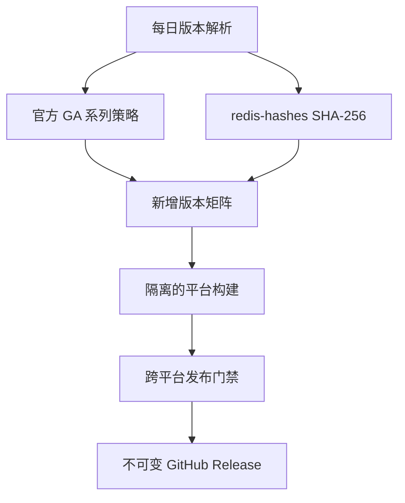

# 多平台发布方案

[English](PLATFORM-DESIGN.md)

本文描述目标架构。标记为“已设计”的平台不代表二进制包已经发布。当前已经实现的
仍是 `linux-glibc2.28`；其他后端必须通过本文的发布门禁后，才能标记为稳定版。

## Redis 版本范围

“官方所有大版本”按 Redis Open Source 官方版本管理页中的全部 GA `X.Y` 系列
解释，不是把下载目录里的所有历史源码都重新发布。2026-08-20 检查到的首批版本为：

| 系列 | 官方最新补丁版 | 发布类型 |
| --- | --- | --- |
| 6.2 | 6.2.24 | Extended |
| 7.2 | 7.2.16 | Extended |
| 7.4 | 7.4.11 | Extended |
| 8.0 | 8.0.6 | Standard |
| 8.2 | 8.2.9 | Extended |
| 8.4 | 8.4.6 | Standard |
| 8.6 | 8.6.6 | Standard |
| 8.8 | 8.8.2 | Standard |
| 8.10 | 8.10.1 | Standard |

实际跟踪列表保存在 [`config/release-lines.json`](../config/release-lines.json)，表中的
具体补丁版本只是当前快照，后续会自动变化。

Redis 6.0、7.0 及更早版本虽然还能下载，但已不在官方当前 GA 列表中，不进入
自动稳定发布。仍可手工构建一次性 EOL 包，但必须标记为不受支持，也不能覆盖
仍在维护的 Release。

## 打包矩阵

Linux 统一发布 `.tar.gz`，不依赖 RPM、DEB、Snap 或 APK，默认安装位置均为
`/usr/local/redis`。

| 包类型 | 架构 | 受控编译基线 | 服务后端 | 默认目录 | 目标状态 |
| --- | --- | --- | --- | --- | --- |
| `linux-glibc2.28` | x64、arm64 | Rocky Linux 8 用户态 | systemd | `/usr/local/redis` | 已实现 |
| `linux-glibc2.17-legacy` | x64、arm64 | manylinux2014 兼容的 glibc 2.17 sysroot | systemd | `/usr/local/redis` | 已设计，旧系统专用 |
| `linux-musl1.2` | x64、arm64 | 当前仍受支持的最老 Alpine，首期 3.21 | OpenRC | `/usr/local/redis` | 已设计 |
| `macos12` | x64、arm64 | 原生 Runner，部署目标 12.0 | launchd | `/usr/local/redis` | 已设计 |
| `windows-msys2` | x64 | 固定版本的 MSYS2 工具链和运行库 | Windows SCM | `C:\Program Files\Redis` | 已设计，Windows 主包 |
| `windows-cygwin` | x64 | 固定版本的 Cygwin 工具链和运行库 | Windows SCM | `C:\Program Files\Redis` | 已设计，兼容包 |

暂不发布“原生 Windows ARM64”。参考项目和两套 POSIX 兼容运行时目前都以 x64
为主；把能在 ARM64 模拟层运行的 x64 包改名为 ARM64 会误导用户。等到具备可用
工具链，并在真实 ARM64 Windows 上通过服务、持久化和压力测试后再加入。

### ABI 规则

- glibc 2.28 与 glibc 2.17 必须分包。二进制一旦引用较新的版本化 glibc 符号，便
  无法在旧 glibc 上运行。发布前扫描每个 ELF 的最高 `GLIBC_*` 依赖。
- 2.17 包明确标记为 **legacy**。能够兼容旧 libc，不代表已经停止维护的操作系统
  会因此安全或得到支持。
- musl 与 glibc 完全不同，必须单独构建。采用仍受安全维护的最老 Alpine 分支，
  在该分支 EOL 前主动抬升基线；使用 `scanelf`、`ldd` 和 OpenRC 集成测试验收。
- 禁止 `-march=native`。x64 使用保守的 x86-64 基线，arm64 使用基础 AArch64 ISA；
  如需 CPU 优化包，必须使用不同包名。
- macOS 分别在原生 x64 和 arm64 Runner 构建，不合并未经分别测试的 universal 包；
  使用 `MACOSX_DEPLOYMENT_TARGET=12.0`、`otool` 和架构检查作为门禁。

## 压缩包约定

每个包都包含机器可读的 `PACKAGE-INFO`、`BUILD-INFO`、Redis 上游许可证、本项目
引用说明、安装/更新/卸载脚本、服务定义和配置样例。清单格式升级到第 2 版，例如：

```text
PACKAGE_FORMAT=2
PACKAGE_ID=redis-unofficial-builds
REDIS_VERSION=7.4.11
REDIS_SERIES=7.4
PACKAGE_VARIANT=linux-glibc2.17-legacy
PACKAGE_ARCH=x64
OS=linux
LIBC=glibc
MIN_GLIBC=2.17
SERVICE_BACKEND=systemd
INSTALL_PREFIX=/usr/local/redis
UPSTREAM_SOURCE_SHA256=...
PATCHSET_SHA256=...
```

产物名称固定为：

```text
Redis-{version}-{variant}-{arch}.tar.gz
Redis-{version}-{variant}-{arch}.tar.gz.sha256
Redis-{version}-{variant}-{arch}.zip
Redis-{version}-{variant}-{arch}.zip.sha256
```

每个 Redis 补丁版本对应一个 GitHub Release，其中放入所有通过稳定门禁的平台包。
禁止静默覆盖已有产物。Release 同时包含 `manifest.json`、`SHA256SUMS`、SPDX SBOM
和构建来源证明，明确哪些矩阵成功、哪些平台有意不支持。

## 安装、更新与卸载约定

所有后端保持相同的用户可见行为：

1. 修改系统前检查操作系统、架构、ABI、包元数据、二进制版本、服务管理器、目标
   所有权和配置。
2. 程序、配置、数据、日志和安装状态相互分离。
3. 更新时保留配置和数据，备份程序与服务定义，采用原子替换或可回滚替换。
4. 只有服务启动且 Redis 实际响应 PING 才算更新成功，不能只看服务状态为 started。
5. 普通卸载保留配置和数据；`--purge` 只能删除安装状态能够证明由本项目创建的对象。
6. 未显式使用接管/强制选项时，不覆盖其他来源的 Redis 服务或系统账号。

Linux 与 macOS 脚本只依赖稳定、与语言无关的系统接口，同时提供简体中文和英文
消息。Windows PowerShell 脚本和服务帮助也提供两种语言。自动化只读取退出码、
JSON 或键值状态，不解析翻译后的服务输出。

| 服务后端 | 程序位置 | 可变数据 | 关键要求 |
| --- | --- | --- | --- |
| systemd | `/usr/local/redis` | 目录内 `conf/`、`data/`、`logs/` | 前台运行 Redis，尊重配置路径 |
| OpenRC | `/usr/local/redis` | 目录内 `conf/`、`data/`、`logs/` | 使用 POSIX `sh`，不依赖 Bash/systemd |
| launchd | `/usr/local/redis` | 目录内 `conf/`、`data/`、`logs/` | LaunchDaemon 使用安装状态记录的 `_redis` 账号 |
| Windows SCM | `C:\Program Files\Redis` | `C:\ProgramData\Redis` | 服务命令不放可变路径覆盖参数和密码 |

## Windows 后端

Windows 包使用 Redis 官方源码和独立维护、按版本记录的 Windows 补丁集。方案明确
参考 Apache-2.0 开源项目
[`redis-windows/redis-windows`](https://github.com/redis-windows/redis-windows)，
具体引用和后续复制代码时的合规要求见
[`THIRD_PARTY_NOTICES.md`](../THIRD_PARTY_NOTICES.md)，现有 issue 的处理边界见
[Windows issue 覆盖表](WINDOWS-ISSUE-COVERAGE.md)。

MSYS2 是主后端，Cygwin 是附加兼容后端。两者使用不同路径适配器，绝不混用：

- MSYS2 将 `C:\x` 转成 `/c/x`；
- Cygwin 将其转成 `/cygdrive/c/x`；
- 必须转换时调用对应运行时自带的 `cygpath`；服务安装通常只传绝对配置文件路径，
  `dir`、`logfile`、TLS、ACL 和模块路径保留在配置文件中。

服务包装器必须做到：

- 注册前校验配置，并创建经允许的数据与日志目录；
- 强制 `daemonize no`，管理完整子进程树，Redis 启动失败时让 SCM 收到失败状态；
- 等待真实 PING 就绪，不使用固定 100 ms 延迟；
- 停止服务时只向 `redis-cli` 传连接参数，等待优雅退出后才使用有时限的进程树兜底；
  密码不得出现在服务命令行和日志里；
- Redis 子进程意外退出时同步停止/标记 Windows 服务失败，并设置有限次数的 SCM 恢复；
- 记录 stdout/stderr 和实际配置路径；
- 为所有 EXE 写入 Redis 版本和打包修订号的 PE VERSIONINFO；
- 使用独立服务名称支持 Sentinel 模式；
- 使用 `C:\ProgramData\Redis\install-state.json` 保护更新、回滚、接管和卸载。

Windows 稳定门禁覆盖：含空格和非 ASCII 路径、服务重启、错误配置的失败透传、优雅
停止、重启后持久化、BGSAVE、端口占用诊断、Sentinel 和有上限的压力测试。Release
必须使用优化构建（`-O2`，不沿用参考工作流里的 `-O0`），并公开基准测试结果；不能
承诺经过 POSIX 兼容层后仍达到 Linux 原生性能。

## 自动发现与发布



解析器每日定时运行，也支持手工触发：

1. 读取 `config/release-lines.json`。
2. 通过 HTTPS 获取 `redis/redis-hashes`，为每个 `X.Y` 选择最高稳定 `X.Y.Z`，忽略
   RC、beta 和 milestone。
3. 必须找到官方 SHA-256；下载官方源码包并校验通过后才解压。
4. 比较期望产物清单和已有 Release，只构建缺少的版本或显式要求重建的版本。
5. 各构建任务使用只读仓库权限；全部必要门禁通过后，单独的聚合任务才获得
   `contents: write` 并创建不可变 Release。

已登记系列的每个新补丁版都会自动构建和发布。全新的 `X.Y` 系列可能同时改变
许可证、组件、编译器或 Windows 补丁，因此先自动构建“不发布候选包”，再创建一
个小型配置 PR。PR 验证并合并后，该系列后续补丁完全自动化。这样既不用人工盯版本，
也不会未经审查就发布新的产品线。

定时构建失败时不得删除或覆盖上个 Release。保留日志和候选产物，并按 Redis 版本
与矩阵项创建或更新唯一的跟踪 issue。

## 发布门禁

所有版本和稳定平台均必须通过：

- 官方 SHA-256 与可复现源码 URL 校验；
- 在 `BUILD-INFO` 中记录编译器、运行库和补丁哈希；
- 平台允许时执行上游 `make test`；
- 二进制架构、依赖和 ABI 检查；
- PING、SET/GET、过期、持久化/重启和正常停止；
- 全新安装、从同系列上一个补丁更新、失败回滚、保留数据卸载和安全彻底卸载；
- 含空格和非 ASCII 的自定义配置、数据和日志路径；
- 中英文帮助与错误流程；
- 校验和、SBOM 和构建来源证明验证。

实验平台失败可以不阻塞其他稳定平台，但必须在清单中明确失败。稳定平台的服务或
数据完整性测试失败时，不能把该产物伪装成成功发布。

## 实施顺序

1. 把固定 7.4 的解析器改为多系列发布控制器和清单聚合，同时保留已工作的 glibc
   2.28 构建。
2. 增加 glibc 2.17、musl/OpenRC Linux 构建与服务测试。
3. 增加 macOS x64/arm64 原生构建和 launchd 生命周期脚本。
4. 增加 Windows 服务包装器和两种运行时适配器，把 issue 覆盖表变成回归测试；
   全部门禁完成前仅发布 Windows prerelease。
5. 开启各系列的自动稳定发布，以及新系列候选 PR。
