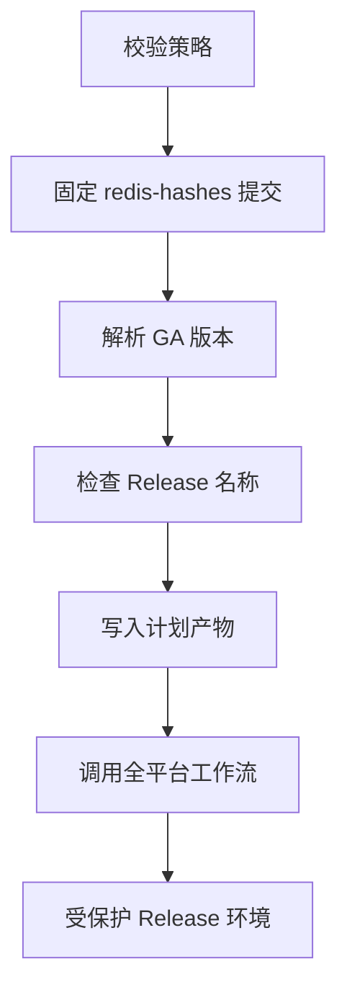

# 多平台发布方案

[English](PLATFORM-DESIGN.md)

本文明确区分原子化稳定 Release、手工生成的实验性 Actions artifact 和仅设计后端。
“已实现”表示代码、CI、语义校验、原生生命周期门禁和稳定发布策略均已存在。手工
触发只读平台构建器时仍生成实验性 artifact；只有受保护的稳定发布调用方才能把这些
Job 绑定到 `Redis-X.Y.Z` Release。“仅设计”表示不宣称存在构建产物。

## Redis 发布系列

跟踪的 `X.Y` 系列声明在
[`config/release-lines.json`](../config/release-lines.json)。控制器为每个已登记系列
选择存在官方 SHA-256 记录的最高稳定 `X.Y.Z`，不会重新构建所有历史源码包。当前
配置登记 `6.2`、`7.2`、`7.4`、`8.0`、`8.2`、`8.4`、`8.6`、`8.8`、
`8.10`；最终以配置文件为准。

系列登记依据 Redis
[官方版本管理策略](https://redis.io/docs/latest/operate/oss_and_stack/install/version-mgmt/)。
已登记系列超过配置的 EOL 日期后停止自动计划。高于 `new_series_floor` 的新稳定
系列只会列为候选项，必须经过配置审查后才能进入构建计划。预发布版本不纳入计划。

许可证审查是系列门禁。根据 Redis 官方
[许可说明](https://redis.io/legal/licenses/)，7.2.x 及更早版本使用
BSD-3-Clause，7.4.x 至 7.8.x 使用 RSALv2/SSPLv1，Redis 8 及以上可选择
RSALv2、SSPLv1 或 AGPLv3。包必须保留已校验版本的准确许可证和 notices。
Redis 名称与标识仍受官方
[商标政策](https://redis.io/legal/trademark-policy/)约束。

## 平台矩阵

| 包变体 | 架构 | 构建基线 | 服务后端 | 状态 |
| --- | --- | --- | --- | --- |
| `linux-glibc2.28` | x64、ARM64 | 按摘要固定的 Rocky Linux 8 用户态 | systemd | **已实现** |
| `linux-glibc2.17-legacy` | x64、ARM64 | 按摘要固定的 manylinux2014（glibc 2.17） | systemd 或无服务模式 | **已实现** |
| `linux-musl1.2` | x64、ARM64 | 按摘要固定的 musllinux 1.2 | OpenRC | **已实现** |
| `macos15` | x64、ARM64 | 原生 macOS 15 Runner、部署目标 15.0 | launchd | **已实现** |
| `windows-msys2` | x64 | Windows Server 2022 Runner 与 MSYS2 | Windows SCM | **已实现**；Windows 主后端 |

9 个平台行均启用控制器，稳定包身份都绑定 `build-all-platforms.yml`。全平台工作流会调用只读
平台工作流完成额外原生 Job，但这个实现细节不会改变包元数据记录的稳定工作流身份。
所有 Linux 包均使用 `.tar.gz`，不依赖 RPM、DEB、Snap 或 APK，固定前缀为
`/usr/local/redis`。Windows 使用 `.zip` 和固定目录
`C:\Program Files\Redis-Unofficial`。

当前运行身份清理之前创建的安装会被新更新脚本明确拒绝。请先备份配置与
数据，使用已安装包内的生命周期脚本卸载，再执行全新安装。

### ABI 原则

- glibc 2.28 二进制不能假定可在 glibc 2.17 上运行。legacy 包必须单独构建，并
  扫描每个 ELF 的最高 `GLIBC_*` 符号。
- 兼容旧 libc 不代表已停止维护的操作系统安全或受支持。
- musl 与 glibc 是不同 ABI，不能共用包。musl 后端需要原生依赖检查和真实 OpenRC
  生命周期测试。
- 禁止 `-march=native`。除非增加独立命名的优化变体，否则 x64 与 ARM64 使用保守
  指令集基线。
- macOS 每个架构分别原生构建和测试。部署目标是 ABI 下限，不是安全维护承诺。
- 在模拟层运行的 x64 Windows 包不能标记为 ARM64。原生 Windows ARM64 必须具备
  兼容原生工具链，并在 ARM64 Windows 上完成服务、持久化及负载测试。

## 已实现 glibc 包约定

当前使用 `core` 配置：包含 Redis 服务端和命令行程序，不包含 Redis 8 捆绑模块。
模块版必须使用独立变体，并设置独立编译器、依赖、许可证、持久化和升级门禁。
TLS 未启用。

每个包以 `redis/` 为顶层，并包含：

- 第 2 版 `PACKAGE-INFO` 和 `BUILD-INFO`；
- Redis 二进制及配置样例；
- 安装、更新和卸载脚本；
- systemd 单元和可选加固样例；
- 上游 `LICENSE.txt`；
- Redis 7.4 及以上版本必有 `UPSTREAM-CONTRIBUTOR-LICENSE.txt`；更早版本仅在
  源码确有 `REDISCONTRIBUTIONS.txt` 时包含；
- 从已校验源码树 `deps/` 中识别的 notices 确定性生成
  `UPSTREAM-DEPENDENCY-NOTICES.txt`；
- 项目 `THIRD_PARTY_NOTICES.md` 和包内 `README.txt`。

更早源码缺少贡献者文件时不会生成占位许可。依赖 notices 按路径确定排序，并使用
路径/长度 framing，限制文件数和大小；它保留上游文本，但不宣称已完成法律分类。
元数据会记录这些文件的哈希；贡献者文件合法缺失时记录明确的 absent 状态。

`PACKAGE-INFO` 关键字段示例：

```text
PACKAGE_FORMAT=2
PACKAGE_ID=redis-unofficial-builds
REDIS_VERSION=7.4.11
REDIS_SERIES=7.4
BUILD_PROFILE=core
PACKAGE_VARIANT=linux-glibc2.28
PACKAGE_ARCH=x64
OS=linux
LIBC=glibc
MIN_GLIBC=2.28
SERVICE_BACKEND=systemd
INSTALL_PREFIX=/usr/local/redis
UPSTREAM_SOURCE_SHA256=...
UPSTREAM_CONTRIBUTOR_LICENSE_SHA256=...
UPSTREAM_DEPENDENCY_NOTICES_SHA256=...
PATCHSET_SHA256=...
```

CI 构建器以无特权账号在受控容器中运行，通过 HTTPS 下载官方源码，在解压前校验
计划中的 SHA-256，执行上游构建/测试代码，并只从私有暂存树打包。脚本拒绝 UID 0
以及存在生产 `/usr/local/redis` 的主机。打包仓库快照由 root 所有且对构建账号
只读。DNF 依赖从 Rocky 软件源动态解析，因此记录编译器/运行库信息，但不宣称
逐字节可复现。

## 可复用平台构建约定

平台工作流先固定并严格解析官方 `redis/redis-hashes` 快照，下载对应源码包，再把
已校验源码传给各构建 Job。仓库权限只有 `contents: read`，没有 Tag、Release、下游
工作流分发 API 或发布步骤。手工触发时设置 `PACKAGE_STATUS=experimental` 并记录
`build-experimental.yml`；这些保留 7 天的 Actions artifact 不能进入
`Redis-X.Y.Z` Release；若不可变历史 Tag 无法复用，则使用配置的
`Redis-X.Y.Z-rN` 打包修订 Tag，Release 标题仍为 `Redis X.Y.Z`。

由 `build-all-platforms.yml` 调用时，相同 Job 接收调用方的精确版本、源码 SHA-256 和不可变
哈希提交，设置 `PACKAGE_STATUS=release` 并记录 `build-all-platforms.yml`。glibc 2.17 使用
第 2 版格式，musl、macOS 和 Windows 使用第 3 版格式。两种格式都绑定源码摘要、
redis-hashes 提交、打包提交、精确平台身份、经审查生命周期文件和包含稳定工作流的
补丁集摘要，因此手工包不能仅靠改名伪装成正式包。

包校验不只信任文件名。校验器不解压读取包，拒绝多余成员、路径穿越、链接、特殊
文件、不安全权限、超大内容、压缩炸弹、架构/运行库不匹配和启用状态的
`loadmodule`。它从包内真实内容核对 ELF 架构、解释器、动态依赖、Redis 版本、最高
`GLIBC_*` 符号，Mach-O 架构与最低系统版本，以及 Windows PE 架构、Redis 版本、
MSYS2 DLL 清单/notices、生命周期脚本和服务包装器。

生命周期验收覆盖全新和重复安装、就绪、更新、已保存数据重载、普通卸载恢复、彻底
卸载及平台特定失败边界。OpenRC、launchd 和 Windows 执行故障注入更新回滚。Windows
还测试含空格/非 ASCII 的暂存路径、端口冲突安装回滚、BGSAVE、有界
`redis-benchmark`、Sentinel 二进制身份、子进程异常退出后的 SCM 恢复，以及基于 `redis.conf`
认证的就绪与优雅关闭。TLS 未构建也不宣称支持。glibc 2.17 门禁在固定 legacy 用户态
使用 `--no-service`；相同 systemd 生命周期文件由两个 glibc 2.28 架构独立测试。

## 当前 GitHub Release 约定

一个纯数字 Redis `X.Y.Z` Tag 对应一个 Release。全平台发布器只接受以下精确
21 个产物：

```text
Redis-{version}-linux-glibc2.28-x64.tar.gz
Redis-{version}-linux-glibc2.28-x64.tar.gz.sha256
Redis-{version}-linux-glibc2.28-arm64.tar.gz
Redis-{version}-linux-glibc2.28-arm64.tar.gz.sha256
Redis-{version}-linux-glibc2.17-legacy-x64.tar.gz
Redis-{version}-linux-glibc2.17-legacy-x64.tar.gz.sha256
Redis-{version}-linux-glibc2.17-legacy-arm64.tar.gz
Redis-{version}-linux-glibc2.17-legacy-arm64.tar.gz.sha256
Redis-{version}-linux-musl1.2-x64.tar.gz
Redis-{version}-linux-musl1.2-x64.tar.gz.sha256
Redis-{version}-linux-musl1.2-arm64.tar.gz
Redis-{version}-linux-musl1.2-arm64.tar.gz.sha256
Redis-{version}-macos15-x64.tar.gz
Redis-{version}-macos15-x64.tar.gz.sha256
Redis-{version}-macos15-arm64.tar.gz
Redis-{version}-macos15-arm64.tar.gz.sha256
Redis-{version}-windows-msys2-x64.zip
Redis-{version}-windows-msys2-x64.zip.sha256
SHA256SUMS
manifest.json
redis-unofficial-builds-{version}.spdx.json
```

缺少或多出任何产物都会失败。`SHA256SUMS` 校验其余 20 个文件。
`manifest.json` 绑定源码 URL/SHA-256、不可变 `redis-hashes` 提交、打包提交、
各平台补丁集校验和、工作流、构建配置、操作系统、架构、运行时/ABI 基线、服务
后端、大小和压缩包摘要。

SPDX 2.3 文件以 `filesAnalyzed=false` 描述已校验 Redis 源码和 9 个压缩包，其范围
明确为 `release-package-level`，不能宣传为完整文件级或传递依赖 SBOM。

工作流为 21 个产物生成 SLSA 来源证明，并为 9 个压缩包生成 SPDX 证明。发布前会验证
准确工作流身份、签名者/源码提交、受保护默认分支 ref、predicate 类型，并拒绝
自托管 Runner 证明。

### 只发布全新 Release

发布器只在 Tag 和 Release 均不存在时工作：

1. 9 个平台构建及生命周期测试全部通过；
2. 创建并按语义校验 21 个文件；
3. 生成并验证证明；
4. 一次创建包含所有 21 个文件的草稿 Release；
5. 通过 REST 回读草稿的 `target_commitish`、状态和精确产物清单；
6. 把每个远端产物的数字 ID、字节数和 GitHub SHA-256 摘要绑定到已校验本地文件，
   再下载全部产物并重复语义校验和证明验证；
7. 临发布前再次回读并核对同一草稿身份、草稿/预发布状态、Tag OID、产物 ID、
   字节数、摘要和精确清单；
8. 按数字 Release ID 正式发布并设置 `latest=false`，随后回读正式发布身份，
   再次下载全部产物并重复语义及证明校验。

自动化绝不向已有 Release 添加、覆盖、删除产物，也不会补全它。已有草稿、预发布、
残缺、旧约定或额外产物 Release 都会阻塞自动化并要求维护者审查。已有精确 Release
会被下载、按语义校验、检查 Tag 提交并验证证明，然后跳过构建。
手工指定且不发布的 `force_rebuild` 可在完成校验后生成 Actions 产物，但不能修改
或重新发布该 Release。

发布失败可能留下草稿和 Tag；后续运行会拒绝修改，而不会自动回滚或修复。GitHub
没有覆盖全部草稿字段的原子“比较并发布”操作，因此该项目策略用于补充而不是替代
仓库级 Immutable Releases 和受限的 Release 写权限。

### 仓库外部保护

工作流 YAML 只能引用，不能创建所需保护。仓库管理员必须：

- 使用分支保护规则或 ruleset 保护默认分支；
- 为 `release` Environment 设置必需审核人和部署分支限制，只允许受保护默认分支；
- 生产发布前启用仓库级 Immutable Releases；
- 把 Release 写权限限制在经审查的工作流和可信维护者。

发布任务在获得受限的 `contents: write`、`id-token: write`、
`attestations: write`、`artifact-metadata: write` 前，会检查默认分支 ref 和
`github.ref_protected`。普通计划和构建仍保持只读仓库权限。

## Linux 生命周期约定

已实现脚本依赖 Bash、GNU 常用命令、util-linux 的 `flock`/`setpriv`、账号管理
工具，以及服务模式下的 systemd。发行版软件包名见主 [README](../README.zh-CN.md)。

### 文件系统与账号信任

- 生命周期脚本以 root 运行，但要求解压后的包树由 root 所有、组和其他用户不可写，
  没有扩展 ACL、异常符号链接、多硬链接或特殊文件。普通文件不得带 setuid、setgid 或
  sticky 特殊权限位；目录按所有者和可写性约束，不统一禁止特殊权限位。
- 新建 `redis` 账号禁止登录且仅属于 `redis` 组。已有账号仅在 UID/GID 非 0、
  `redis` 为主组和唯一所属组、Shell 为 `nologin`/`false` 且 home 是规范绝对路径时
  复用。当前格式状态固定记录 UID、主 GID、home、shell 和附加组集合。旧格式状态
  迁移时会清除用户/组创建归属，因为旧格式无法证明完整身份。
- 对当前格式状态，彻底卸载只在项目创建的账号仍精确匹配已记录 UID、主 GID、
  home、shell 且没有附加组时删除账号；用户组必须保持记录的 GID，且不能出现非
  预期的显式成员。缺少完整身份记录的旧状态会保守地保留用户和组；系统已有账号
  始终保留。
- 递归操作在目标或任一后代是挂载点时拒绝执行。
- 安装/更新不会从暂存目录保留 SELinux context 或扩展属性；目标主机需要按自身
  策略应用标签，必要时重标记。

### 配置与服务信任

新配置设置 `port 0`，使用权限 `0770` 的
`/usr/local/redis/data/redis.sock`，数据目录为 `/usr/local/redis/data`。接管和
更新保留已有配置及数据。

配置校验递归跟踪最多 64 个唯一 `include` 文件，并检查 `loadmodule`、`aclfile`
引用。引用可以为绝对路径或相对于 `/usr/local/redis`，但不得包含空白、glob 或
反斜杠。路径组件不得为符号链接；父目录链和单硬链接普通文件必须由 root 安全控制
且没有扩展 ACL。已验证模块路径之后可以保留模块参数。

该约定使受管 `aclfile` 由 root 所有且组和其他用户不可写，Redis 服务账号因此不能
使用 `ACL SAVE` 更新它。管理员必须以 root 离线部署 ACL 变更并重启 Redis，或使用
等效的站点流程，在任何 root 生命周期操作前恢复可信所有权和权限。为运行时
`ACL SAVE` 放宽文件权限后再执行包维护，不属于支持的信任约定。

基础 systemd 单元以前台模式运行 Redis。外部 `redis.service` 默认拒绝；
`--force-service` 也只允许替换 `inactive` 或 `failed` 单元，`active` 或
`reloading` 外部单元始终拒绝。替换 disabled 外部单元后会启用新的受管单元，回滚
会恢复其 disabled 状态；enabled 外部单元保持启用。受管服务的有效单元和 drop-in
会校验准确身份、命令、工作目录、环境/凭据隔离、无执行钩子及
`NoNewPrivileges` 约定。

`--no-service` 是完整的受管安装模式：仍会管理账号、配置/数据目录、包元数据和
生命周期状态，但不要求或注册 systemd。由于没有服务管理器负责停止 Redis，更新
或卸载前必须由管理员停止所有可执行文件精确为
`/usr/local/redis/bin/redis-server` 的进程；只要仍有此类进程，维护操作就会拒绝。

### 更新与删除

- 安装、更新和卸载共用排他锁。
- 更新在停止 Redis 前校验新二进制，保留配置/数据，并把程序、配置、单元、notices、
  元数据和状态备份到 `/usr/local/redis-backups/`。
- Redis 协议响应是就绪条件；启动失败或收到可处理终止信号会回滚程序和服务状态。
- 自动备份不包含 Redis 数据；生产维护需要单独的应用一致快照。
- 默认拒绝降级，只有明确使用 `--allow-downgrade` 才允许。普通卸载保留状态后，
  使用较旧包重新安装也遵循相同门禁；明确允许任一降级操作前必须另做数据快照。
- 普通卸载保留配置、数据、状态、账号和备份；`--purge` 在账号和挂载安全检查后
  删除固定前缀。

## 其他已实现后端

### glibc 2.17 legacy

该包是独立命名的 legacy ABI 兼容包，不替代 glibc 2.28 基线。构建器使用按摘要固定的
manylinux2014，并拒绝任何要求高于 `GLIBC_2.17` 符号的 ELF。正式门禁在对应的
manylinux2014/CentOS 7 用户态中，以 `--no-service` 对两个架构测试全新安装、更新、
已保存数据重载、普通卸载后的恢复和彻底卸载。它复用相同的 systemd 生命周期文件；
其安装、失败回滚、更新回滚、持久化和彻底卸载由两个 glibc 2.28 架构 Job 分别实测。
这是 ABI 兼容约定，不代表已停止维护的发行版重新获得操作系统安全维护。

### musl 与 OpenRC

musl 包在按摘要固定的 musllinux 1.2 镜像中构建，必须使用 musl 解释器，不得包含
`GLIBC_*` 引用，并包含独立 OpenRC 生命周期约定。正式门禁在一次性 Alpine
容器内对两个架构测试 OpenRC 全新和重复安装、服务重启、已保存数据重载、普通卸载、
基于更新的恢复、故障注入更新回滚及彻底卸载。该容器使用 OpenRC softlevel 执行
`rc-service`/`rc-update`，但并非以 OpenRC 作为 PID 1 引导；文档明确保留此限制，
不会据此推断 systemd 兼容性。OpenRC 脚本使用独立服务/状态约定，不依赖 glibc 或
systemd。生命周期入口在加载公共代码前先校验自身，并要求完整解压包目录由 root
所有且组和其他用户不可写。OpenRC 命令行强制 `--daemonize no`；优雅停止允许
600 秒，超时后才进入最终强制终止兜底。

### macOS

两个架构都在原生 macOS 15 Runner 上以 15.0 部署目标构建并执行生命周期验收；包
校验器检查 Mach-O 架构、部署目标和允许的系统动态库路径。launchd 后端管理禁止登录
账号，保留配置/数据，验证 PING，并包含更新/回滚/卸载脚本。正式门禁测试全新和
重复安装、launchd 重启、已保存数据重载、普通卸载后的恢复、故障注入更新回滚和彻底
卸载。不发布 universal 包；x64 和 ARM64 始终独立命名、独立校验。生命周期入口采用
与 musl 相同的加载前自校验和完整暂存树信任检查。launchd 作业强制
`--daemonize no`，并把软、硬 `NumberOfFiles` 限制都设置为 65,536。

### Windows

Windows 方案明确参考 Apache-2.0 许可的
[`redis-windows/redis-windows`](https://github.com/redis-windows/redis-windows)，
并固定提交
[`17fd667560f7903820dcabeebb9d20ade1159fe9`](https://github.com/redis-windows/redis-windows/commit/17fd667560f7903820dcabeebb9d20ade1159fe9)，
以保证设计结论和 issue 映射可复核。本仓库的 Windows 包装器为独立实现，未合入
该项目任何源码文件。归属和未来代码合入要求见
[`THIRD_PARTY_NOTICES.md`](../THIRD_PARTY_NOTICES.md)。

MSYS2 x64 是已实现 Windows 后端。服务包装器以前台模式运行 Redis，校验配置路径，
把启动失败和子进程退出传递给 SCM，执行真实就绪检查，采用有界优雅
关闭和进程树兜底，不把密码放入 CLI 参数，并在捕获的 Redis 输出中遮盖其原文，
记录诊断输出，在固定安装前缀保存受保护状态；备份位于
`C:\ProgramData\Redis-Unofficial\Backups`。数据根目录、备份根目录及每个不可预测命名
的备份都只允许 SYSTEM 或 Administrators 拥有和写入；回滚前会重新校验该信任边界。

Windows 生命周期入口在加载 `Common-Redis.ps1` 前校验所有权、ACL 和重解析点。必须
由提升权限的管理员把包解压到 `Program Files` 等可信系统目录后运行；普通用户所有的
Downloads 或临时目录会被拒绝。

`scripts` 同时提供 `Install-Redis.bat`、`Update-Redis.bat`、
`Uninstall-Redis.bat` 和 `Purge-Redis.bat`，供资源管理器/cmd.exe 使用。准备好受保护
暂存目录后，以管理员身份运行；入口调用同一套 PowerShell 生命周期脚本，保留退出码，
并暂停窗口以便查看结果。`Purge-Redis.bat` 删除数据前会要求确认。

新服务使用 LocalService，而非 LocalSystem。更新旧 LocalSystem 安装时保留服务注册，
并迁移为 LocalService；回滚恢复原账户。遇到自定义服务账户会在替换前拒绝，
不会默默覆盖。创建、更新和回滚都配置有界 SCM 故障恢复策略。原生验收必须检查
服务账户和 Redis 子进程 SID；源码或模拟测试通过不代表该迁移已通过实机验收。

包装器直接从 `conf\redis.conf` 读取 `bind`、`port`、`requirepass`，不需要 JSON
配置或独立密码文件。修改该文件，保存为无 BOM 的 UTF-8 后，在管理员 PowerShell
执行 `Restart-Service -Name RedisUnofficial`。支持本机数字 IPv4/IPv6 地址（含非回环
地址）和自定义端口；通配监听使用回环地址进行服务控制。按 Redis 规则处理引号、
转义和后面的配置覆盖前面的配置。支持安装目录内的明确 `include` 文件，不支持
符号链接、重解析点或通配符；相对路径跟随 Redis 当前工作目录和前面的 `dir`，
不是相对于被包含文件所在目录。解析限制为 16 层文件、64 次读取、总计 4 MiB，
每行最多 65,536 字符。其他 Redis 参数由 Redis 自身校验。

包装器通过 `REDISCLI_AUTH` 使用 `requirepass` 完成就绪与关闭认证。配置只在启动时
读取：运行期间修改文件，停止仍使用当前进程的旧配置，下次启动才读取新配置。
不会跟踪运行时 `CONFIG SET`/ACL 修改。服务要求 `daemonize no`、`supervised no`、
非零普通 TCP 端口及未重命名的 `PING`/`AUTH`/`SHUTDOWN`。内联 `user` ACL、
`aclfile`、TLS、Sentinel 模式会在启动前明确报错。ACL 哈希不能反推出客户端密码，
已有 ACL 部署必须单独评估权限迁移，不应简单删除 ACL 规则；此行为替代了旧版
可选具名用户/密码文件约定。发送关闭命令后最多等待 60 秒，再终止受管进程树。

即使 Redis 版本相同，也应从新包运行 `Update-Redis.ps1`：每次刷新受管程序与脚本，
不再仅凭版本或包装器哈希跳过。更新保留 `conf`、`data`，备份旧 `RedisService.json` 供回滚，
并在新包装器自检通过后删除活动目录中的旧 JSON。已发布旧包在替换前仍使用旧包装器。

Windows Server 2022 门禁覆盖含空格/非 ASCII 的解压路径、端口冲突安装回滚、全新和
重复安装、同版本更新、PING、BGSAVE、有界负载、SCM 重启及子进程异常后的恢复与
持久化键重载、普通卸载保留、基于更新的服务恢复、认证优雅停止/启动、故障注入更新
回滚和彻底卸载。校验 Sentinel 二进制身份，但不发布受管 Sentinel 服务。未启用也不
宣称 TLS 或 AOF 专项验收。Windows 当前为兼容 MSYS2 使用 `-O0`，正式包也不例外；
不运行完整上游 Redis 测试套件，改由协议冒烟和原生生命周期检查覆盖已声明功能。
优化构建尚未验收，不承诺 POSIX 兼容层具有 Linux 同等性能。详见
[Windows issue 覆盖表](WINDOWS-ISSUE-COVERAGE.md)。

门禁新增通过 include 配置非回环 IP、自定义端口和带引号密码，以及运行时修改端口/
密码后无 JSON 优雅重启的回归。这些新增用例必须在 Windows 通过后才能发布新版包；
本地解析测试不能替代 Windows SCM 验收。

### OpenRC 与 launchd 生命周期安全

同版本更新也刷新程序文件，并保留 `conf`、`data`。异常或信号退出会进入回滚；
替换或删除前必须停服成功，且专用服务账户下没有残留进程。回滚不完整时保留
安装目录和备份并报错；排查期间不要强制删除目录。每个递归删除都会拒绝目标自身或
其下的挂载点，普通卸载及安装/更新回滚路径也不例外。

就绪检查使用私有 Unix socket，将 `PONG`、`NOAUTH` 或 `NOPERM` 识别为 Redis
协议响应，但不代表凭据或 ACL 配置正确。每次 CLI 探测限制为约 3 秒。开启 TCP 或
认证时应保留控制 socket；如更改其路径，从新包执行
`sudo env REDIS_READY_SOCKET=/absolute/path/to/redis.sock ./scripts/update.sh`。
该变量不会修改 Redis 配置。仅检查 socket 不能验证另一个 TCP/TLS 监听端点。

## 版本解析与构建编排

[发布控制器](RELEASE-CONTROLLER.md)使用检入仓库的
`controller_mode=auto_release` 策略。定时运行会自动把每个可发布的已登记版本传给
受保护的全平台工作流。手工运行默认只生成计划，只有选择 `run_builds=true` 才会
执行构建；新系列候选仍需经过配置审查后登记：



控制器本身不编译包也不创建 Tag，而是把源码校验和及不可变的 `redis-hashes` 提交传给
每个可发布版本的一次 `package_arch=all` 工作流调用。全平台工作流负责内容和证明
校验，只有通过受保护默认分支和 `release` Environment 门禁后才创建并发布 Release。
阻塞行会被排除，但不会抑制其他系列的可发布行。

## 发布门禁

已实现稳定平台必须具备：

- 与不可变 `redis-hashes` 提交绑定的官方源码 SHA-256；
- 适用上游许可证、贡献者文本、依赖 notices 和项目 notices；
- 元数据中的编译器/运行库、打包提交及补丁集哈希；
- 上游测试（仅 Linux/macOS；Windows 运行冒烟与原生生命周期检查）、
  架构/依赖/ABI 检查及冒烟测试；
- 全新安装、就绪、更新、回滚、持久化、接管、卸载、彻底卸载、账号复用、挂载及
  外部服务安全测试；
- 英文和简体中文生命周期路径；
- 默认仅本地 Socket，且保留接管的监听、认证、持久化、模块和 include 配置；
- 精确 21 产物元数据和完整 `SHA256SUMS` 校验；
- Release 包级 SPDX 校验；
- 来源/SPDX 证明生成及受限验证；
- 只创建新草稿、回读精确清单、下载验证和单向正式发布；
- 受保护默认分支和 `release` Environment 审批。

仅设计平台不能因为配置中存在工作流或产物名称就加入已实现 Release；手工生成的
实验性 artifact 也不能改名后作为稳定包发布。
